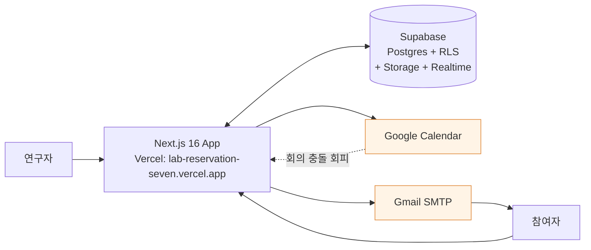

# Exp_Platform by Joonoh

**연구실 공용 실험 스케쥴링 플랫폼**

여러 연구자가 동시에 서로 다른 실험을 돌릴 때, 참여자 모집·예약·알림·캘린더 관리를 한 곳에서 처리합니다.

---

## 한눈에 보기



연구자는 실험을 만들고, 참여자는 공개 링크로 접속해 주간 그리드에서 원하는 시간대를 고릅니다. 확정되는 순간 DB 기록 + Google Calendar 일정 + Gmail 안내가 동시에 진행됩니다.

내부 메커니즘 (LLM 코드 분석기, 실시간 채널, outbox/cron, NAS 미러), 사용자 흐름 (자료 업로드 vs 검색), 데이터 흐름, PII 보호, 운영 한계 등은 [`docs/architecture.md`](./docs/architecture.md) 에 한 페이지로 정리되어 있습니다.

---

## 무엇이 해결되나

- **중복 예약 구조적으로 차단** — 두 명이 같은 슬롯을 동시에 누르면 DB advisory lock으로 한 쪽만 통과
- **과거 시간 예약 차단** — DB가 거절
- **캘린더 일정과 자동 충돌 회피** — FreeBusy API로 기존 일정 빼고 슬롯 노출
- **다회차 실험 회차 번호 자동 부여** — 날짜 순서대로 1, 2, 3회차
- **참여자 PII 는 캘린더 제목에 노출 안 됨** — 제목은 `[이니셜] 프로젝트/Sbj N/Day D` 만. 단 이벤트 description 본문에는 이름·이메일·전화가 평문으로 들어가므로 SLab 캘린더 공유 권한자에 한해 열람 가능 ([architecture.md §4](./docs/architecture.md))
- **연구자별 권한 분리** — Supabase RLS로 자기 실험만 관리
- **무료 운영 가능** — Supabase Free + Vercel Free + Gmail 앱 비밀번호

---

## 부가 기능

- **전체 일정 보기** (`/schedule`) — 연구실 구성원 전원의 확정 예약을 연구자별 색상으로 한 화면에 표시
- **대시보드** (`/dashboard`) — 다가오는 7일 예약 + 최근 활동 + 내 진행 중 실험 현황
- **자동 리마인더** — 실험 전날 18:00, 당일 09:00 (KST) 기본, 실험별 커스텀 가능
- **예약 변경/취소** — 캘린더 이벤트도 동시 갱신
- **수동 블록** — 연구자가 특정 시간대를 예약 불가로 지정
- **자동 잠금** — 정원이 모두 차면 실험 상태가 '완료'로 자동 전환
- **Notion 연동 (선택)** — 실험 날짜·시간·피험자 ID·프로젝트·코드 경로·데이터 경로·파라미터·노트를 같은 DB에서 관리. 상세: [`docs/notion-db-template.md`](./docs/notion-db-template.md)
- **온라인 실험 모드** — 참여자가 /run 페이지의 샌드박스 브라우저에서 과제를 수행. 연구자 JS는 `window.expPlatform.submitBlock()` 하나만 구현하면 됨. 카운터밸런싱·스크리너·주의 체크·pilot 모드·행동 신호 수집까지 플랫폼이 처리. 설계 가이드: [`docs/online-experiment-designer-guide.md`](./docs/online-experiment-designer-guide.md)

---

## 기술 스택

Next.js 16 (App Router) · React 19 · Supabase (Postgres + Auth + RLS) · Vercel · Google Calendar API · Gmail SMTP

---

## 설치

```bash
git clone https://github.com/CSNL-vnilab/Exp_Platform_by_Joonoh.git
cd Exp_Platform_by_Joonoh
npm install
cp .env.example .env.local   # 값 채우기

supabase login
supabase link --project-ref <your-ref>
supabase db push

npm run bootstrap-admin      # 관리자 계정 생성
npm run dev                  # http://localhost:3000
```

필수 키 4종:
1. Supabase: `NEXT_PUBLIC_SUPABASE_URL`, `NEXT_PUBLIC_SUPABASE_ANON_KEY`, `SUPABASE_SERVICE_ROLE_KEY`
2. Google Calendar: 서비스 계정 JSON → `npm run install-service-account <json> <calendar-id>`
3. Gmail: `GMAIL_USER` + `GMAIL_APP_PASSWORD`
4. 내부: `CRON_SECRET` (`openssl rand -hex 32`)

## Vercel 배포

```bash
npx vercel link
npm run push-vercel-env
npx vercel deploy --prod
```

## 테스트

```bash
npm run e2e-booking          # 단일 세션 풀 싸이클
npm run e2e-time-est         # 다회차 + Sbj 할당
npm run e2e-multi-sbj10      # 여러 참여자 연속 예약
```

---

Built by **Joonoh** · [github.com/CSNL-vnilab/Exp_Platform_by_Joonoh](https://github.com/CSNL-vnilab/Exp_Platform_by_Joonoh) · MIT
