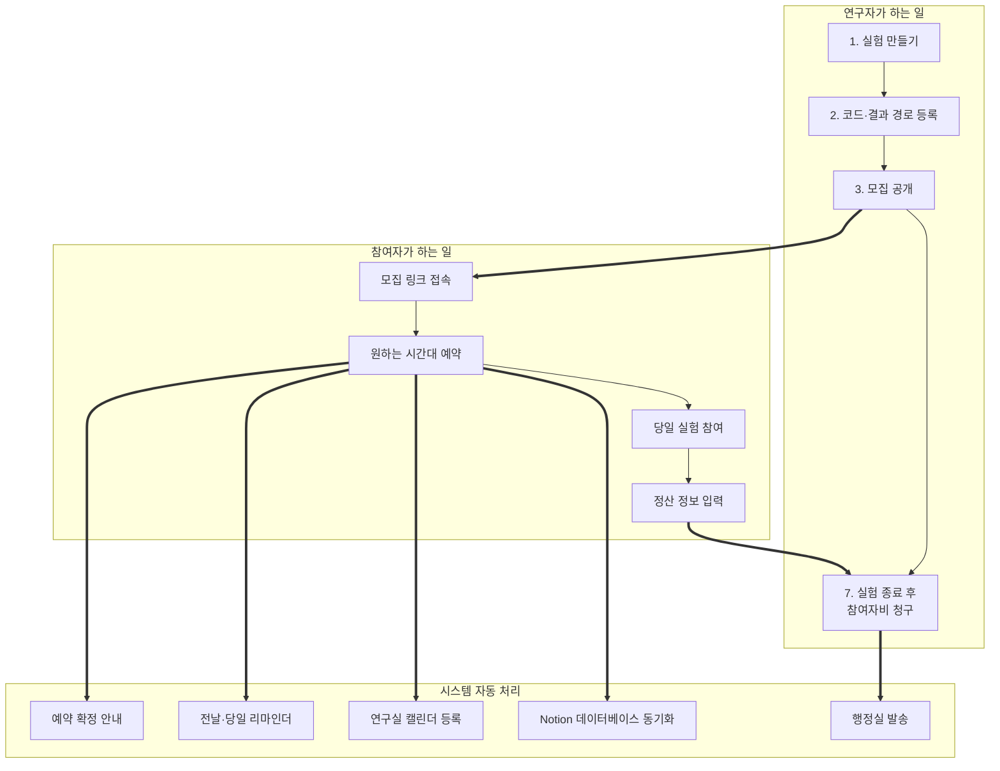
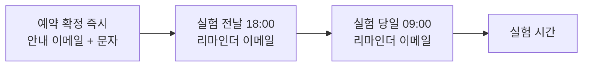
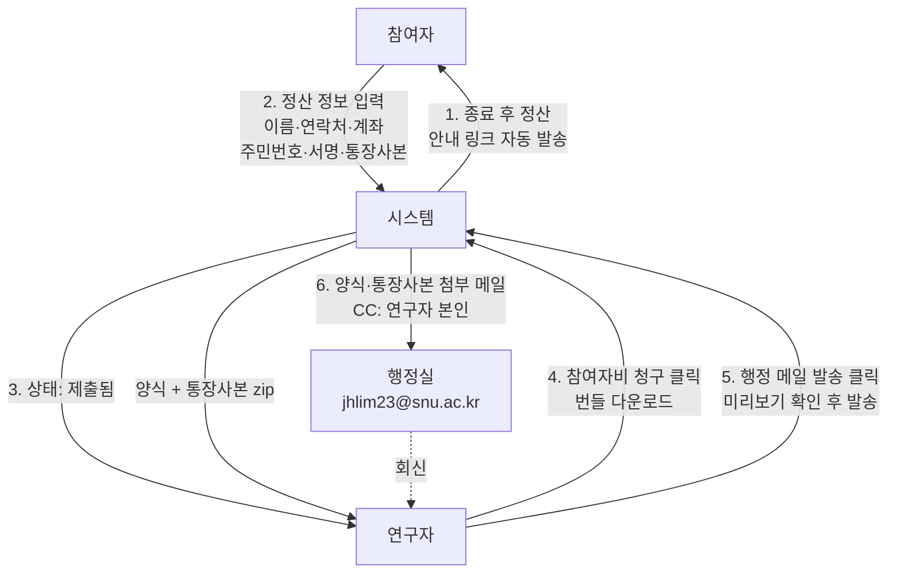

# CSNL 실험 예약 시스템 — 연구원 안내서

연구실 공용 실험을 만들고, 참여자를 모집·예약·관리하고, 실험 종료 후 참여자비
청구까지 한 곳에서 처리합니다.

- 운영 주소: <https://lab-reservation-seven.vercel.app>
- 문의: 박준오 (joonop99@snu.ac.kr)

---

## 한눈에 보기


```mermaid
flowchart TB
  subgraph R["연구자가 하는 일"]
    direction TB
    R1["1. 실험 만들기"]
    R2["2. 코드·결과 경로 등록"]
    R3["3. 모집 공개"]
    R4["7. 실험 종료 후<br/>참여자비 청구"]
    R1 --> R2 --> R3 --> R4
  end

  subgraph P["참여자가 하는 일"]
    direction TB
    P1["모집 링크 접속"]
    P2["원하는 시간대 예약"]
    P3["당일 실험 참여"]
    P4["정산 정보 입력"]
    P1 --> P2 --> P3 --> P4
  end

  subgraph S["시스템 자동 처리"]
    direction TB
    S1["예약 확정 안내"]
    S2["전날·당일 리마인더"]
    S3["연구실 캘린더 등록"]
    S4["Notion 데이터베이스 동기화"]
    S5["행정실 발송"]
  end

  R3 ==> P1
  P2 ==> S1
  P2 ==> S2
  P2 ==> S3
  P2 ==> S4
  P4 ==> R4
  R4 ==> S5
```

---

## 1. 실험 만들기 (실험 배포)

대시보드 우측 상단의 **"새 실험 만들기"** 버튼을 누릅니다.

입력 항목:

| 항목 | 설명 |
|---|---|
| 실험 제목 | 참여자에게 보이는 이름 |
| 프로젝트 | 어떤 연구 과제에 속하는지 (Notion 프로젝트 데이터베이스와 연결됨) |
| 모집 안내 | 모집 페이지 상단에 표시되는 한 문단 |
| 장소 | 미리 등록된 실험실 중 선택 (6번 항목 참고) |
| 회당 진행 시간 | 분 단위. 슬롯 길이를 결정합니다. |
| 회당 참여자 수 | 동시에 진행 가능한 인원 |
| 회차 수 | 한 참여자가 며칠에 걸쳐 참여하는지. 1회면 단일 세션. |
| 참여자 보상 | 회당 금액 (원) |
| 모집 기간 | 시작·종료 날짜 |
| IRB 승인 번호·문서 | 행정 제출용. 첨부 파일 업로드 가능. |
| 실험 모드 | 오프라인 또는 온라인 |
| 유의사항 | 참여자에게 자동 전달될 안내문 (7번 항목 참고) |

저장하면 자동으로 다음이 진행됩니다.

- Notion 의 SLab 데이터베이스에 실험 페이지 자동 생성
- 모집 페이지에서 보일 슬롯 그리드 생성 (모집 기간 × 가능 시간대)

기본 상태는 "초안" 입니다. 실제로 모집을 시작하려면 실험 상세 페이지에서
"모집 공개" 토글을 켜야 합니다.

## 2. 코드 업로드

실험 코드는 두 가지 방식 중 하나로 연결합니다.

### 2-가. 코드 디렉토리 경로 등록 (오프라인·온라인 공통)

연구실 NAS 또는 GitHub 저장소의 경로를 실험에 등록합니다.

- 실험 상세 페이지 → **"코드 분석"** 탭 → 경로 입력
- 등록된 경로는 자동으로 정적 분석되어 실험 task 구조·자극 종류·종속변수가
  추정됩니다.
- 분석 결과는 같은 페이지에서 확인할 수 있고, Notion 페이지에도 함께
  동기화됩니다.

### 2-나. 온라인 실험 — 런타임 통합

온라인 실험은 참여자가 `/run/<참여자토큰>` 경로에 접속하면 격리된 브라우저
창에서 연구자가 작성한 실험 코드가 자동으로 로드됩니다.

연구자는 실험 코드 안에서 다음 한 가지만 호출하면 됩니다.

```javascript
window.expPlatform.submitBlock({
  blockNumber: 1,
  trials: [...]  // 임의의 직렬화 가능한 데이터
});
```

카운터밸런싱·주의 체크·시간 동기화·서명·결과 저장은 시스템이 처리합니다.
자세한 작성 방법은 [온라인 실험 작성 가이드](docs/online-experiment-designer-guide.md)
를 참고합니다.

## 3. Notion 연동

실험을 만들면 Notion 의 SLab 데이터베이스에 자동으로 페이지가 생성·갱신됩니다.

동기화되는 항목:

- 실험 제목, 프로젝트, 진행 기간, 회당 참여자 수, 진행 상태
- 예약별 회차 번호, 참여자 식별번호 (이름은 가명화되어 노출되지 않음)
- 코드 디렉토리 경로, 결과 디렉토리 경로
- 참여자별 진행 메모 (실험 후 결과 기록 시)

동기화 시점:

- 실험 생성·수정 즉시
- 예약 확정·취소·수정 즉시
- 자동 동기화에 실패하면 30분마다 최대 5회 자동 재시도. 5회 모두 실패하면
  대시보드의 "동기화 실패" 카드에 표시됩니다.

수동으로 다시 동기화하려면 실험 페이지에서 **"Notion 재동기화"** 버튼을
누릅니다.

## 4. 실험 결과 디렉토리 연동

실험 결과 파일이 저장되는 경로를 실험에 등록할 수 있습니다.

- 실험 상세 → **"결과 경로"** 항목에 입력
- 오프라인 실험: 연구자가 직접 입력 (예: `/Volumes/CSNL_new/data/exp01/`)
- 온라인 실험: 시스템이 자동 입력. Supabase Storage 의
  `experiment-data/<실험ID>/<예약ID>/` 경로 아래에 블록별 결과 파일과 행동
  지표가 저장됩니다.

결과 경로는 Notion 페이지에도 동기화되므로, 추후 분석할 때 같은 데이터베이스에서
코드 경로와 결과 경로를 함께 추적할 수 있습니다.

## 5. 참여자 모집

실험 상세 페이지의 **"모집 공개"** 토글을 켜면 외부에서 접근 가능한 모집
페이지가 활성화됩니다.

- 공개 주소: `https://lab-reservation-seven.vercel.app/book/<실험ID>`
- 이 주소를 카카오톡, 학회 공지, 게시판 등에 직접 게시합니다.

참여자가 모집 페이지에 들어오면:

- 가능한 시간대만 표시된 주간 그리드를 봅니다.
- 이미 다른 사람이 예약한 슬롯이나 캘린더에서 차단된 시간은 자동으로
  숨겨집니다.
- 슬롯을 누르면 이름·연락처·이메일·참여 동의를 입력하는 폼이 열립니다.
- 제출 즉시 예약이 확정됩니다 (같은 슬롯을 두 사람이 동시에 누르면 한 명만
  통과합니다).

확정 즉시 자동으로 처리되는 일:

- 참여자에게 안내 이메일 + 문자 발송
- 연구실 공용 캘린더에 일정 자동 등록 (제목은 이니셜만, 본문에 상세 정보)
- Notion 데이터베이스에 예약 페이지 자동 생성

## 6. 장소 안내

장소는 실험을 만들 때 미리 등록된 실험실 목록에서 선택합니다.

새 장소 등록은 관리자만 가능합니다. **관리자 메뉴 → "장소 관리"**:

- 장소 이름 (예: "220동 649호 행동실험실")
- 주소 (여러 줄 가능)
- 지도 링크 (네이버 지도, 카카오맵 등)

참여자에게 자동으로 전달되는 정보:

- 예약 확정 이메일에 장소 이름·주소·지도 링크가 포함됩니다.
- 리마인더 이메일에도 같은 정보가 들어갑니다.
- 행정 제출용 실험참여자비 양식에도 장소가 자동으로 채워집니다.

## 7. 유의사항

실험별로 참여자에게 전달할 안내문을 입력할 수 있습니다.

- 실험 상세 → **"유의사항"** 입력란 (자유 양식 텍스트)
- 예: "참여 전 8시간 동안 카페인 섭취 금지", "안경 착용 권장", "도착 시
  220동 649호로 직접 와주세요"

자동으로 전달되는 시점:

- 예약 확정 이메일 본문
- 전날·당일 리마인더 이메일

## 8. 예약 리마인더

확정된 예약에 대해 자동으로 발송되는 안내가 있습니다.


```mermaid
flowchart LR
  E1["예약 확정 즉시<br/>안내 이메일 + 문자"]
  E2["실험 전날 18:00<br/>리마인더 이메일"]
  E3["실험 당일 09:00<br/>리마인더 이메일"]
  S["실험 시간"]
  E1 --> E2 --> E3 --> S
```

- 시각은 한국 시간 기준입니다.
- 실험별로 "전날 리마인더 끄기"·"당일 리마인더 끄기"·"발송 시각 변경"이
  가능합니다 (실험 상세 → "리마인더 설정").
- 발송 실패 시 자동으로 재시도합니다.

## 9. 예약 수정·취소

연구자가 예약을 변경하거나 취소할 수 있습니다 (참여자 요청 응대용).

- 실험 상세 → **"예약"** 탭 → 해당 예약의 우측 메뉴
- 변경 가능: 시간대 (다른 슬롯으로), 참여자 정보
- 취소: "취소" 버튼 → 사유 입력

자동으로 따라가는 처리:

- 참여자에게 변경 안내 이메일 (이전 시간 → 이후 시간 명시) + 문자
- 연구실 캘린더 일정 자동 갱신
- Notion 페이지 자동 갱신
- 리마인더 시각이 자동으로 재계산됩니다 (시간대가 바뀌면 새 시간 기준으로
  재발송)

참여자 본인이 취소할 때도 같은 자동 처리가 동작합니다. 참여자는 확정
이메일의 "변경/취소" 링크를 통해 본인 예약만 취소할 수 있습니다.

## 10. 데이터 입력 리마인더 (DB 리마인더)

실험을 진행한 뒤 메타데이터를 채우지 않은 채로 두면, 매주 월요일 오전 9시
(한국 시간)에 연구자에게 자동 안내가 발송됩니다.

발송 대상: 본인 명의의 실험 중 다음 항목 가운데 비어 있는 것이 있는 경우.

- 코드 디렉토리 경로
- 결과 디렉토리 경로
- IRB 승인 번호
- 자극 세트 버전
- 그 외 실험별 필수 항목 — [실험 메타데이터 요구사항](docs/experiment-field-requirements.md)
  참고

대시보드의 **"메타데이터 누락"** 카드에서도 어느 실험의 어떤 항목이 비어
있는지 확인할 수 있습니다.

## 11. 참여자비 청구

실험 종료 후 참여자에게 정산 정보를 받고, 행정실에 청구서를 자동
발송하는 흐름입니다.


```mermaid
flowchart TB
  P["참여자"]
  S["시스템"]
  R["연구자"]
  A["행정실<br/>jhlim23@snu.ac.kr"]

  S -->|"1. 종료 후 정산<br/>안내 링크 자동 발송"| P
  P -->|"2. 정산 정보 입력<br/>이름·연락처·계좌<br/>주민번호·서명·통장사본"| S
  S -->|"3. 상태: 제출됨"| R
  R -->|"4. 참여자비 청구 클릭<br/>번들 다운로드"| S
  S -->|"양식 + 통장사본 zip"| R
  R -->|"5. 행정 메일 발송 클릭<br/>미리보기 확인 후 발송"| S
  S -->|"6. 양식·통장사본 첨부 메일<br/>CC: 연구자 본인"| A
  A -.회신.-> R
```

### 단계별 안내

| 단계 | 누가 | 어디서 | 무엇을 |
|---|---|---|---|
| 1 | 시스템 | 자동 | 슬롯 종료 후 약 7일이 지나면 참여자에게 정산 정보 입력 안내 메일이 자동으로 발송됩니다. |
| 2 | 참여자 | 정산 링크 페이지 | 이름·연락처·계좌·주민등록번호·서명·통장사본 사진을 입력하고 제출합니다. |
| 3 | 연구자 | `/experiments/<실험ID>/bookings` 의 "참여자비 정산" 카드 | 참여자 상태가 "제출됨" 으로 바뀐 것을 확인합니다. |
| 4 | 연구자 | 같은 카드 | **"📦 참여자비 청구 (N명)"** 버튼을 누르면 양식과 통장사본 zip 이 한 파일로 묶여 다운로드됩니다. |
| 5 | 연구자 | 청구 직후 활성화되는 옆 버튼 | **"📧 행정 메일 발송"** 버튼을 누릅니다. |
| 6 | 연구자 | 미리보기 모달 | 받는 사람(`jhlim23@snu.ac.kr` 기본값)·본문·첨부 파일 5개를 확인한 뒤 **"발송"** 버튼을 누릅니다. |
| 7 | 시스템 | 자동 | 행정실로 메일이 발송되고, 연구자 본인에게도 사본(CC)이 도착합니다. 회신은 자동으로 연구자에게 전달됩니다. |

자동으로 채워지는 행정 양식 메타데이터 (2026 3차년도 기준):

- SRnD 과제번호: `339-20260009`
- 연구기간: `2026.05.01 - 2027.04.30`
- 연구책임자: 이상훈

### 자주 묻는 상황

- **참여자가 서명·통장사본을 입력하지 않음** → 청구는 진행되지만 해당 첨부만
  비어 있습니다. 참여자에게 정산 안내 링크를 재발송한 뒤 다시 청구합니다.
- **발송 실패** → 모달 상단에 빨간색 배너로 정확한 원인이 표시됩니다.
  내용을 박준오에게 캡쳐와 함께 공유해 주세요.
- **이미 발송한 청구** → 같은 청구로는 발송 버튼이 다시 나타나지 않습니다.
  다음 참여자가 정산 정보를 제출하면 새 청구를 만들 수 있습니다.
- **청구 가능한 참여자가 없다고 표시됨** → 참여자가 아직 정산 정보를
  입력하지 않은 상태입니다. 참여자에게 안내 메일을 재발송하세요.

### 참여자에게 입력 안내 메일 재발송

정산 정보 입력 링크가 만료되었거나 참여자가 분실한 경우:

- 같은 카드의 해당 참여자 행 → **"정산 안내 재발송"** 버튼
- 이전 링크는 무효화되고 새 링크가 발송됩니다.

---

## 운영 정보

### 자동 처리 시각 (한국 시간 기준)

| 시각 | 자동 처리 |
|---|---|
| 15분마다 | 예약 리마인더 발송 (확정된 예약 중 발송 시각이 도래한 것) |
| 30분마다 | 외부 연동 (Notion·캘린더·이메일·문자) 실패 자동 재시도 |
| 매일 새벽 1시 | Notion 데이터베이스 정합성 점검 |
| 매일 새벽 2시 15분 | 슬롯 종료 후 7일 경과한 예약 자동 완료 처리 + 참여자에게 정산 안내 발송 |
| 매주 월요일 오전 9시 | 메타데이터 누락 실험 안내 (연구자에게) |

### 권한

| 역할 | 가능한 일 |
|---|---|
| 연구원 | 본인이 만든 실험만 보기·수정. 본인 실험의 예약·정산·청구 관리. |
| 관리자 | 모든 실험 보기·수정. 사용자 가입 승인. 장소·유의사항 양식 등록. |

### 문의

- 박준오 (joonop99@snu.ac.kr)
- 시스템 버그·개선 제안: GitHub 저장소
  [CSNL-vnilab/Exp_Platform_by_Joonoh](https://github.com/CSNL-vnilab/Exp_Platform_by_Joonoh)
  에 Issue 등록

---

본 문서는 연구원 관점의 사용 안내서입니다. 시스템 내부 구조는
[docs/architecture.md](docs/architecture.md), 운영 절차는
[docs/ops-playbook.md](docs/ops-playbook.md), 새 항목 추가 등 개발자
관점의 안내는 [AGENTS.md](AGENTS.md) 를 참고합니다.
