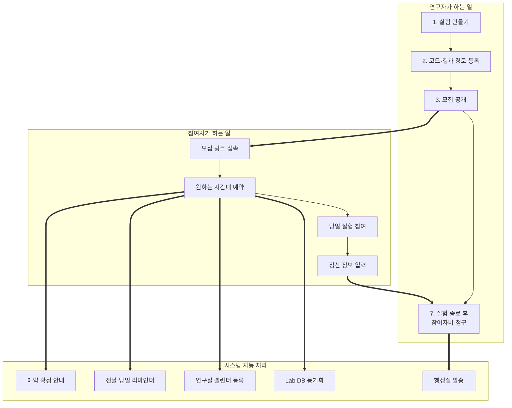
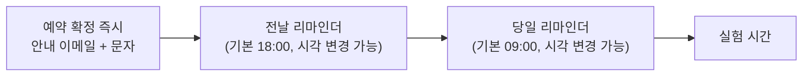
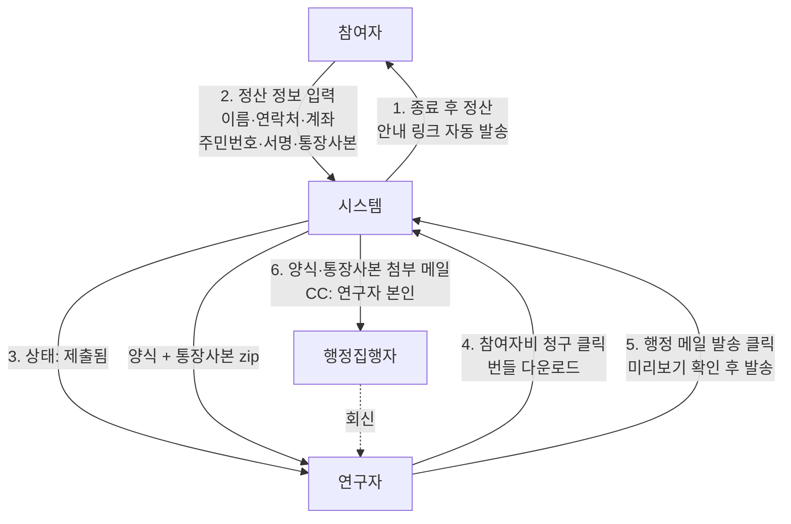

# CSNL 실험 예약 시스템 — 연구원 안내서

연구실 공용 실험을 만들고, 참여자를 모집·예약·관리하고, 실험 종료 후 참여자비
청구까지 한 곳에서 처리합니다.

- 운영 주소: <https://lab-reservation-seven.vercel.app>

---

## 최근 변경 (2026-06)

직전 하드닝 사이클(Phase A + iter 1–39)과 후속 연구원 리뷰에서 반영된
참여자·운영 관점의 변경입니다. 전체 설계 청사진과 의사결정 근거는
[`docs/architecture/`](docs/architecture/README.md) 에 정리되어 있습니다.

- **참여자 셀프 예약 수정·취소 안정화.** 확정 이메일의 "변경/취소" 링크에서
  이름 + 전화번호 본인 확인을 거쳐 예약을 직접 수정·취소할 수 있습니다.
  본인 확인 직후 다음 화면으로 넘어가지 않던 문제(확인 세션 쿠키가 페이지
  경로로 전달되지 않던 버그)를 수정했고, 전화번호 입력 형식(하이픈/공백/국가
  번호 `+82`)이 달라도 본인 확인이 통과하도록 정규화를 보강했습니다.
- **개인정보 보호 강화.** 외부 연동(캘린더·메일·문자·Lab DB) 실패 로그에
  참여자 이메일·전화번호가 남지 않도록 모든 오류 기록 지점에서 마스킹합니다.
- **운영 관측성.** 시크릿 설정·아웃박스 큐·레이트리밋 상태를 점검하는 health
  엔드포인트와 크론 실패 알림(연결 대기)이 추가되었습니다.
- **남은 운영 작업.** Slack 웹훅 등록 + 크론 알림 배선은
  [`docs/architecture/PENDING-OPERATOR-ACTIONS.md`](docs/architecture/PENDING-OPERATOR-ACTIONS.md)
  에 실행 체크리스트로 정리되어 있습니다.

> 취소한 참여자가 **같은 시간대**로 곧바로 재예약할 때 슬롯이 잠깐 "마감"으로
>보일 수 있습니다 — 취소 시 공용 캘린더 일정이 삭제되지만 Google 캘린더
> 반영에 지연이 있거나 삭제가 실패하면 그 시간이 잠시 차단됩니다. 위
> 체크리스트의 캘린더 정리(orphan-reaper) 크론이 연결되면 자동 해소되며,
> 그 전에는 다른 시간대를 선택하거나 담당 연구원이 관리자 화면에서 정리하면
> 됩니다.

---

## 다른 연구실의 도입 안내 · For adopting laboratories

이 코드베이스는 forkable open source 입니다. 다른 연구실이 그대로 가져가
자체 운영할 수 있도록, 세 가지 설계 원칙을 따랐습니다.

- **운영비 0원 (free-tier-by-construction).** 전체 스택이 무료 등급 관리형
  서비스 위에 구성됩니다: 관리형 Postgres + 인증 + 오브젝트 스토리지, 서버리스
  함수 호스트, 기관 메일 계정을 통한 트랜잭션 메일, 지역 SMS 게이트웨이, 공유
  캘린더 API, 외부 지식베이스 API. 연구실이 기관 계정으로 이미 접근 가능한
  서비스 외에 추가 결제 항목은 없습니다. **`$0/month`** 으로 모집-예약-실험-
  결과수집-참여자비 청구 전 사이클을 자체 운영할 수 있습니다.
- **연구실 자체 보유 (lab-sovereign).** 코드베이스, 데이터베이스, 첨부 파일,
  참여자 개인정보 모두 도입 연구실 본인의 Supabase / Vercel 계정 안에
  머무릅니다. 외부 SaaS 벤더가 데이터를 중계하거나 보관하지 않습니다. IRB /
  GDPR / 기관 데이터 거주 요구가 까다로운 연구실에 적합한 배포 형태입니다.
- **수정·확장 가능 (forkable & extensible).** 기관-특이적 값 — 참여자비
  양식(.xlsx), 메일 본문, 행정실 주소, 캘린더 식별자, 단가 — 은 모두 환경
  변수와 deployment-config 로 분리되어 있습니다. 코드 수정 없이 도입 연구실에
  맞게 설정만 바꾸면 됩니다. 새 운영(operation #12 등)이 필요하면 테이블 한 개
  + 라우트 한 개 + 크론 한 개를 추가하는 정도의 국지적 변경으로 가능합니다.
  스키마 자체는 한 자리에서 끝까지 읽을 수 있는 크기(약 60 테이블)로
  유지됩니다.

전체 방법론 논문 초안 (Nature Methods / NeurIPS 타깃, 익명화된 버전) 은
[`paper/`](./paper/) 디렉토리에 있습니다.

### 실험–분석–출판을 단일 DB + GitHub commit 으로 연결

도입 연구실이 얻는 가장 큰 운영적 이점은 한 연구의 *모든 단계* — 모집 →
실험 → 분석 → 출판 — 가 동일한 `experiments.id` 아래로 묶여 단일 foreign
key trail 로 추적된다는 것입니다.

- 실험 코드 등록 시 자동 정적 분석(LLM 요약) → 연구자 확인을 거쳐, 조작
  변수 / 종속 변수 / 랜덤 시드·counterbalance 처리 방식 / 파라미터 파일
  체크섬 / 저장 경로가 DB row 로 박힙니다.
- 실험 수행 시 해당 세션이 사용한 runtime 의 git commit hash 가 booking
  row 에 결합됩니다.
- 분석 노트북·스크립트도 같은 `experiments.id` 아래 등록할 수 있으며,
  분석에 사용된 commit 도 함께 박힙니다.
- 모든 코드 변경이 GitHub 으로 push 되어, DB 의 row 와 실제 코드 버전이
  결합된 상태로 보존됩니다.
- 결과 발표 후 manuscript / preprint URL 도 같은 row 의 속성으로 추가
  가능합니다.

결과적으로 한 연구의 publish 이후, 외부에서 manuscript 만 보고 알 수 없는
실무적 결정들 — 어떤 시점에 어떤 commit 이 실제로 돌았는지, 어떤 참여자가
어떤 사유로 언제 제외되었는지, 어떤 파라미터 sweep 이 시도되었다가 보고
되지 않았는지 — 이 schema 안에 영구적인 audit trail 로 남습니다. 인수
인계, 공동 연구, 사후 감사, 메타 분석에 모두 유리한 상태로 유지됩니다.

---

## 한눈에 보기


```mermaid
flowchart TB
  subgraph R["연구자가 하는 일"]
    direction TB
    R1["1. 실험 만들기"]
    R2["2. 코드·결과 경로 등록"]
    R3["3. 모집 공개"]
    R4["7. 실험 종료 후<br/>참여자비 청구"]
    R1 --> R2 --> R3 --> R4
  end

  subgraph P["참여자가 하는 일"]
    direction TB
    P1["모집 링크 접속"]
    P2["원하는 시간대 예약"]
    P3["당일 실험 참여"]
    P4["정산 정보 입력"]
    P1 --> P2 --> P3 --> P4
  end

  subgraph S["시스템 자동 처리"]
    direction TB
    S1["예약 확정 안내"]
    S2["전날·당일 리마인더"]
    S3["연구실 캘린더 등록"]
    S4["Lab DB 동기화"]
    S5["행정실 발송"]
  end

  R3 ==> P1
  P2 ==> S1
  P2 ==> S2
  P2 ==> S3
  P2 ==> S4
  P4 ==> R4
  R4 ==> S5
```

---

## 1. 실험 만들기 (실험 배포)

대시보드 우측 상단의 **"새 실험 만들기"** 버튼을 누릅니다.

입력 항목:

| 항목 | 설명 |
|---|---|
| 실험 제목 | 참여자에게 보이는 이름 |
| 프로젝트 | 어떤 연구 과제에 속하는지 (Lab DB 의 프로젝트 항목과 연결됨) |
| 모집 안내 | 모집 페이지 상단에 표시되는 한 문단 |
| 장소 | 미리 등록된 실험실 중 선택 (6번 항목 참고) |
| 회당 진행 시간 | 분 단위. 슬롯 길이를 결정합니다. |
| 회당 참여자 수 | 동시에 진행 가능한 인원 |
| 회차 수 | 한 참여자가 며칠에 걸쳐 참여하는지. 1회면 단일 세션. |
| 참여자 보상 | 회당 금액 (원) |
| 모집 기간 | 시작·종료 날짜 |
| IRB 승인 번호·문서 | 행정 제출용. 첨부 파일 업로드 가능. |
| 실험 모드 | 오프라인 또는 온라인 |
| 유의사항 | 참여자에게 자동 전달될 안내문 (7번 항목 참고) |

저장하면 자동으로 다음이 진행됩니다.

- Lab DB 에 실험 항목 자동 생성
- 모집 페이지에서 보일 슬롯 그리드 생성 (모집 기간 × 가능 시간대)

기본 상태는 "초안" 입니다. 실제로 모집을 시작하려면 실험 상세 페이지에서
"모집 공개" 토글을 켜야 합니다.

## 2. 코드 업로드

실험 코드는 두 가지 방식 중 하나로 연결합니다.

### 2-가. 코드 디렉토리 경로 등록 (오프라인·온라인 공통)

연구실 NAS 또는 GitHub 저장소의 경로를 실험에 등록합니다.

- 실험 상세 페이지 → **"코드 분석"** 탭 → 경로 입력
- 등록된 경로는 자동으로 정적 분석되어 실험 task 구조·자극 종류·종속변수가
  추정됩니다.
- 분석 결과는 같은 페이지에서 확인할 수 있고, Lab DB 의 해당 실험 항목에도
  함께 동기화됩니다.

### 2-나. 온라인 실험 — 런타임 통합

온라인 실험은 참여자가 `/run/<참여자토큰>` 경로에 접속하면 격리된 브라우저
창에서 연구자가 작성한 실험 코드가 자동으로 로드됩니다.

연구자는 실험 코드 안에서 다음 한 가지만 호출하면 됩니다.

```javascript
window.expPlatform.submitBlock({
  blockNumber: 1,
  trials: [...]  // 임의의 직렬화 가능한 데이터
});
```

카운터밸런싱·주의 체크·시간 동기화·서명·결과 저장은 시스템이 처리합니다.
자세한 작성 방법은 [온라인 실험 작성 가이드](docs/online-experiment-designer-guide.md)
를 참고합니다.

## 3. Lab DB 연동

실험을 만들면 연구실 자체 DB 에 실험 항목이 자동으로 생성·갱신됩니다. 한
실험을 중심으로 *누가* (연구자) · *언제* (실험 진행 일정) · *무엇* (프로젝트) ·
*왜* (연구노트) 가 서로 연결되도록 설계된 구조입니다.

동기화되는 항목:

- 실험 제목, 프로젝트, 진행 기간, 회당 참여자 수, 진행 상태
- 예약별 회차 번호, 참여자 식별번호 (이름은 가명화되어 노출되지 않음)
- 코드 디렉토리 경로, 결과 디렉토리 경로
- 참여자별 진행 메모 (실험 후 결과 기록 시)

동기화 시점:

- 실험 생성·수정 즉시
- 예약 확정·취소·수정 즉시
- 자동 동기화에 실패하면 30분마다 최대 5회 자동 재시도. 5회 모두 실패하면
  대시보드의 "동기화 실패" 카드에 표시됩니다.

수동으로 다시 동기화하려면 실험 페이지에서 **"Lab DB 재동기화"** 버튼을
누릅니다.

## 4. 실험 결과 디렉토리 연동

실험 결과 파일이 저장되는 경로를 실험에 등록할 수 있습니다.

- 실험 상세 → **"결과 경로"** 항목에 입력
- 오프라인 실험: 연구자가 직접 입력 (예: `/Volumes/CSNL_new/data/exp01/`)
- 온라인 실험: 시스템이 자동 입력. Supabase Storage 의
  `experiment-data/<실험ID>/<예약ID>/` 경로 아래에 블록별 결과 파일과 행동
  지표가 저장됩니다.

결과 경로는 Lab DB 의 실험 항목에도 동기화되므로, 추후 분석할 때 같은 DB
안에서 코드 경로와 결과 경로를 함께 추적할 수 있습니다.

## 5. 참여자 모집

실험 상세 페이지의 **"모집 공개"** 토글을 켜면 외부에서 접근 가능한 모집
페이지가 활성화됩니다.

- 공개 주소: `https://lab-reservation-seven.vercel.app/book/<실험ID>`
- 이 주소를 카카오톡, 학회 공지, 게시판 등에 직접 게시합니다.

참여자가 모집 페이지에 들어오면:

- 가능한 시간대만 표시된 주간 그리드를 봅니다.
- 이미 다른 사람이 예약한 슬롯이나 캘린더에서 차단된 시간은 자동으로
  숨겨집니다.
- 슬롯을 누르면 이름·연락처·이메일·참여 동의를 입력하는 폼이 열립니다.
- 제출 즉시 예약이 확정됩니다 (같은 슬롯을 두 사람이 동시에 누르면 한 명만
  통과합니다).

확정 즉시 자동으로 처리되는 일:

- 참여자에게 안내 이메일 + 문자 발송
- 연구실 공용 캘린더에 일정 자동 등록 (제목은 이니셜만, 본문에 상세 정보)
- Lab DB 에 예약 항목 자동 생성

## 6. 장소 안내

장소는 실험을 만들 때 미리 등록된 실험실 목록에서 선택합니다.

새 장소 등록은 관리자만 가능합니다. **관리자 메뉴 → "장소 관리"**:

- 장소 이름 (예: "220동 649호 행동실험실")
- 주소 (여러 줄 가능)
- 지도 링크 (네이버 지도, 카카오맵 등)

참여자에게 자동으로 전달되는 정보:

- 예약 확정 이메일에 장소 이름·주소·지도 링크가 포함됩니다.
- 리마인더 이메일에도 같은 정보가 들어갑니다.
- 행정 제출용 실험참여자비 양식에도 장소가 자동으로 채워집니다.

## 7. 유의사항

실험별로 참여자에게 전달할 안내문을 입력할 수 있습니다.

- 실험 상세 → **"유의사항"** 입력란 (자유 양식 텍스트)
- 예: "참여 전 8시간 동안 카페인 섭취 금지", "안경 착용 권장", "도착 시
  220동 649호로 직접 와주세요"

자동으로 전달되는 시점:

- 예약 확정 이메일 본문
- 전날·당일 리마인더 이메일

## 8. 예약 리마인더

확정된 예약에 대해 자동으로 발송되는 안내가 있습니다.  **발송 시각은 실험별로
연구자가 자유롭게 지정할 수 있습니다** — 아래 시각은 변경하지 않았을 때
적용되는 기본값입니다.


```mermaid
flowchart LR
  E1["예약 확정 즉시<br/>안내 이메일 + 문자"]
  E2["전날 리마인더<br/>(기본 18:00, 시각 변경 가능)"]
  E3["당일 리마인더<br/>(기본 09:00, 시각 변경 가능)"]
  S["실험 시간"]
  E1 --> E2 --> E3 --> S
```

리마인더 설정 (실험 상세 → **"리마인더 설정"**):

| 항목 | 설정 가능 범위 |
|---|---|
| 전날 리마인더 켜기/끄기 | 실험별로 토글 |
| 전날 리마인더 발송 시각 | 임의의 시각 (기본 18:00) |
| 당일 리마인더 켜기/끄기 | 실험별로 토글 |
| 당일 리마인더 발송 시각 | 임의의 시각 (기본 09:00) |
| 발송 채널 | 이메일·문자·둘 다 |

- 모든 시각은 한국 시간 기준입니다.
- 시각을 바꾸면 해당 실험의 모든 예약에 즉시 반영됩니다 (이미 발송된 건은
  영향 없음).
- 발송 실패 시 자동으로 재시도합니다.

## 9. 예약 수정·취소

연구자가 예약을 변경하거나 취소할 수 있습니다 (참여자 요청 응대용).

- 실험 상세 → **"예약"** 탭 → 해당 예약의 우측 메뉴
- 변경 가능: 시간대 (다른 슬롯으로), 참여자 정보
- 취소: "취소" 버튼 → 사유 입력

자동으로 따라가는 처리:

- 참여자에게 변경 안내 이메일 (이전 시간 → 이후 시간 명시) + 문자
- 연구실 캘린더 일정 자동 갱신
- Lab DB 항목 자동 갱신
- 리마인더 시각이 자동으로 재계산됩니다 (시간대가 바뀌면 새 시간 기준으로
  재발송)

참여자 본인이 취소할 때도 같은 자동 처리가 동작합니다. 참여자는 확정
이메일의 "변경/취소" 링크를 통해 본인 예약만 취소할 수 있습니다.

## 10. 데이터 입력 리마인더 (DB 리마인더)

실험을 진행한 뒤 메타데이터를 채우지 않은 채로 두면, 매주 월요일 오전 9시
(한국 시간)에 연구자에게 자동 안내가 발송됩니다.

발송 대상: 본인 명의의 실험 중 다음 항목 가운데 비어 있는 것이 있는 경우.

- 코드 디렉토리 경로
- 결과 디렉토리 경로
- IRB 승인 번호
- 자극 세트 버전
- 그 외 실험별 필수 항목 — [실험 메타데이터 요구사항](docs/experiment-field-requirements.md)
  참고

대시보드의 **"메타데이터 누락"** 카드에서도 어느 실험의 어떤 항목이 비어
있는지 확인할 수 있습니다.

## 11. 참여자비 청구

실험 종료 후 참여자에게 정산 정보를 받고, 행정실에 청구서를 자동
발송하는 흐름입니다.


```mermaid
flowchart TB
  P["참여자"]
  S["시스템"]
  R["연구자"]
  A["행정집행자"]

  S -->|"1. 종료 후 정산<br/>안내 링크 자동 발송"| P
  P -->|"2. 정산 정보 입력<br/>이름·연락처·계좌<br/>주민번호·서명·통장사본"| S
  S -->|"3. 상태: 제출됨"| R
  R -->|"4. 참여자비 청구 클릭<br/>번들 다운로드"| S
  S -->|"양식 + 통장사본 zip"| R
  R -->|"5. 행정 메일 발송 클릭<br/>미리보기 확인 후 발송"| S
  S -->|"6. 양식·통장사본 첨부 메일<br/>CC: 연구자 본인"| A
  A -.회신.-> R
```

### 단계별 안내

| 단계 | 누가 | 어디서 | 무엇을 |
|---|---|---|---|
| 1 | 시스템 | 자동 | 슬롯 종료 후 약 7일이 지나면 참여자에게 정산 정보 입력 안내 메일이 자동으로 발송됩니다. |
| 2 | 참여자 | 정산 링크 페이지 | 이름·연락처·계좌·주민등록번호·서명·통장사본 사진을 입력하고 제출합니다. |
| 3 | 연구자 | `/experiments/<실험ID>/bookings` 의 "참여자비 정산" 카드 | 참여자 상태가 "제출됨" 으로 바뀐 것을 확인합니다. |
| 4 | 연구자 | 같은 카드 | **"📦 참여자비 청구 (N명)"** 버튼을 누르면 양식과 통장사본 zip 이 한 파일로 묶여 다운로드됩니다. |
| 5 | 연구자 | 청구 직후 활성화되는 옆 버튼 | **"📧 행정 메일 발송"** 버튼을 누릅니다. |
| 6 | 연구자 | 미리보기 모달 | 받는 사람(행정집행자 기본값)·본문·첨부 파일 5개를 확인한 뒤 **"발송"** 버튼을 누릅니다. |
| 7 | 시스템 | 자동 | 행정실로 메일이 발송되고, 연구자 본인에게도 사본(CC)이 도착합니다. 회신은 자동으로 연구자에게 전달됩니다. |

자동으로 채워지는 행정 양식 메타데이터 (2026 3차년도 기준):

- SRnD 과제번호: `339-20260009`
- 연구기간: `2026.05.01 - 2027.04.30`
- 연구책임자: 이상훈

### 자주 묻는 상황

- **참여자가 서명·통장사본을 입력하지 않음** → 청구는 진행되지만 해당 첨부만
  비어 있습니다. 참여자에게 정산 안내 링크를 재발송한 뒤 다시 청구합니다.
- **발송 실패** → 모달 상단에 빨간색 배너로 정확한 원인이 표시됩니다.
  내용을 시스템 관리자에게 캡쳐와 함께 공유해 주세요.
- **이미 발송한 청구** → 같은 청구로는 발송 버튼이 다시 나타나지 않습니다.
  다음 참여자가 정산 정보를 제출하면 새 청구를 만들 수 있습니다.
- **청구 가능한 참여자가 없다고 표시됨** → 참여자가 아직 정산 정보를
  입력하지 않은 상태입니다. 참여자에게 안내 메일을 재발송하세요.

### 참여자에게 입력 안내 메일 재발송

정산 정보 입력 링크가 만료되었거나 참여자가 분실한 경우:

- 같은 카드의 해당 참여자 행 → **"정산 안내 재발송"** 버튼
- 이전 링크는 무효화되고 새 링크가 발송됩니다.

---

## 12. 참여자 관리 — roster · 홍보 메일 · 블랙리스트

좌측 메뉴 **참여자 관리** 는 랩 전체 참여자 명단(roster)을 보고, 선택한
참여자에게 홍보 메일을 한 번에 보내고, 문제 행동을 보인 참여자를
블랙리스트로 등록(승인 큐 경유)하는 단일 화면입니다. 관리자뿐 아니라
연구원도 사용할 수 있습니다 (2026-05-19 directive).

### 12-가. 표시되는 컬럼

| 컬럼 | 내용 |
|---|---|
| 공개 ID | `CSNL-XXXXXX` 형식의 pseudonymous 식별자 (Slack/메모용) |
| 이름 / 이메일 / 연락처 | 실제 PII. 블랙리스트 참여자는 연락처가 끝 4자리로 자동 마스킹 |
| 참여 실험 | 그 사람이 예약(완료/예정)한 실험 제목들. 모드 탭에 맞춰 자동 필터링 |
| 클래스 | 뉴비 / 로열 / VIP / 블랙리스트. 블랙리스트 행은 사유가 함께 표시 |
| 완료 세션 / 최근 참여일 | 모드 탭에 한정된 집계 |

### 12-나. 오프라인 · 온라인 모드 탭

상단의 **오프라인 / 온라인 / 전체** 탭은 `experiments.experiment_mode`
기준으로 roster + 집계 + 홍보 모달의 실험 드롭다운까지 모두 분기합니다.

- **오프라인 (기본값)** — 모집·예약을 통해 들어온 진짜 참여자 풀.
  TimeExpOnline1 등 온라인 실험 + 다수의 E2E/테스트 참여자가 섞이지 않습니다.
- **온라인** — 온라인 실험 참여자만. 보통 E2E·이상관찰자 검증에서 생성된
  합성 ID 가 다수.
- **전체** — 모드 무시. 전체 합집합.

탭을 전환하면 선택된 참여자 체크박스는 자동으로 초기화됩니다 (모드 간
실수 발송 방지).

### 12-다. 홍보 메일 일괄 발송 (체크박스 선택 → 모달)

체크박스로 N명을 고른 뒤 상단 선택 바의 **"홍보 메일 보내기"** 버튼:

1. 진행 중(`status='active'`)인 실험 중 현재 모드에 해당하는 것만 드롭다운에 노출.
2. 제목과 본문 템플릿이 실험 정보(모집 기간 / 운영 요일·시간 / 세션 / 참여비 /
   소개 / 예약 페이지 URL)로 자동 채워집니다. **그대로 자유롭게 수정**할 수
   있습니다.
3. **편집 ↔ 미리보기** 탭으로 서버가 렌더링한 실제 HTML 결과를 확인.
4. **발송**: 단일 이메일이 To = 발신 계정(self), BCC = 선택한 deliverable
   참여자 전원으로 나갑니다. 주소록은 서로 노출되지 않습니다.
5. 발송 결과는 `participant_promo_sends` 에 한 행씩 기록되어 같은 실험에
   대해 중복 발송을 자동 차단합니다.

자동 제외 대상:
- 이메일이 없거나 placeholder(`@-` 등)
- 같은 실험으로 이미 발송된 참여자
- **블랙리스트 — 어떤 경우에도 발송되지 않습니다 (서버측 hard gate).**

### 12-라. 블랙리스트 등록 — 연구원 신청 + 관리자 승인

연구원이 직접 블랙리스트로 분류할 수는 없습니다. 대신:

1. 참여자 관리에서 체크박스로 대상자를 고른 뒤 **"블랙리스트 등록 신청"**.
2. 모달에서 **사유** (2자 이상, 필수) + **연락처 끝 4자리** (선택, 식별용,
   전체 번호를 입력해도 끝 4자리만 저장) 입력.
3. 신청 즉시 `vnilab@gmail.com → vnilab@gmail.com (CC: 신청자)` 로 승인
   요청 메일이 발송되고, 좌측 메뉴 **블랙리스트 승인** (관리자 전용) 에
   pending 행으로 쌓입니다.
4. 관리자가 큐에서 **승인** 누르면:
   - 클래스가 즉시 `blacklist` 로 전환 (`assign_participant_class_manual`
     RPC, audit trigger 발화).
   - `participants.phone` 가 신청 시 입력된 끝 4자리로 덮어쓰여
     이후 UI 에선 끝 4자리만 노출됩니다 (전체 번호는 저장 안 함).
   - 예정된 confirmed / running 예약은 자동 취소 (cascade-cancel, P2-3).
5. **반려** 누르면 신청자가 볼 수 있는 짧은 메모와 함께 status=rejected.
   같은 참여자에 대해 새 pending 을 다시 신청할 수 있습니다.

블랙리스트 행은 참여자 관리 목록에서 클래스 뱃지 아래에 빨간 글씨로
사유가 함께 표시되어 한 눈에 식별됩니다.

### 12-마. 운영 시 안전장치

- 한 참여자 × 한 lab 에 동시에 하나의 `pending` 만 존재 가능 (partial UNIQUE).
- 60초 cooldown 은 단발 admin UI 의 안전장치이며, RPC 자체에는 적용되지
  않아 큐 일괄 처리는 즉시 진행 가능.
- 모든 클래스 변경은 `participant_class_audit` 에 기록 → 참여자 상세 화면의
  "클래스 변경 이력" 카드에서 추적.

---

## 13. Claude Code 부트스트랩 (private marketplace)

이 저장소 루트(`.claude-plugin/marketplace.json`)에 **`csnl-lab`** 이라는 사설
Claude Code 마켓플레이스가 들어 있습니다. 새로운 Claude 세션이 이 저장소
유지/보수를 시작할 때 한 번의 명령으로 환경(PATH)과 운영 워크플로우(슬래시
명령 + 스킬)를 모두 끌어옵니다.

### 한 번의 설치

```bash
claude plugin marketplace add /Users/csnl/Documents/claude/lab-reservation-main
claude plugin install lab-reservation@csnl-lab
```

설치 후 새 세션을 열면:

- **SessionStart 훅**이 `restore-env.sh` 를 실행해 `node`, `gh`, `supabase`,
  `vercel` 을 PATH 위로 끌어올립니다. brew 가 사라져도 동작 — Codex.app 의 번들
  `node` 와 `/opt/homebrew/Cellar/*/bin` 안에 남아있는 바이너리를 자동으로
  reseat 합니다.
- 슬래시 명령이 노출됩니다:
  - **`/lab-restore-env`** — 위 PATH 패치를 수동으로 한 번 더 실행 + 누락된
    바이너리(특히 `gh`) 복구 가이드.
  - **`/lab-ship`** — `feat/blacklist-cleanup-docs` 같은 임시 브랜치 만들고
    `ALLOW_FEATURE_BRANCH=1 git push origin <branch>:main` 으로 fast-forward,
    Vercel 배포까지 확인하는 전체 절차.
  - **`/lab-verify`** — 최신 Vercel 배포가 Ready 이고 `lab-reservation-seven`
    alias 가 붙어있는지 확인.
  - **`/lab-migrate`** — 새 `supabase/migrations/000NN_*.sql` 파일을
    `supabase db query --linked --file` 로 적용하고 `migration repair --status
    applied 000NN` 로 트래커를 맞추는 패턴. 이 저장소의 마이그레이션 트래킹
    drift 를 피해갑니다.
- 4개의 운영 런북 스킬이 자동 색인됩니다:
  - **`lab-deploy-runbook`** — 멀티세션 작업트리에서 안전하게 main 으로
    푸시하는 방법(다른 세션의 WIP 보존, `git branch -D` 실수로 commit
    날린 사례 포함).
  - **`lab-supabase-migration`** — `db push` 가 막힐 때 `db query` 로 우회 +
    `repair --status applied` 로 트래커 동기화하는 절차.
  - **`lab-blacklist-workflow`** — 연구원 신청 → 관리자 승인 → 클래스 전환 +
    연락처 끝 4자리 마스킹 + cascade-cancel 흐름과 promo email hard gate.
  - **`lab-promo-email`** — BCC-from-self 템플릿 흐름과 3종 hard-gate
    (undeliverable / already-sent / blacklisted).

### 환경이 또 망가졌다면

`gh`, `node`, `supabase`, `vercel` 이 갑자기 안 보일 때는 새 Claude 세션을
열거나, 현재 세션에서:

```
/lab-restore-env
```

`restore-env.sh` 가 idempotent 하게 패치합니다. 그래도 실패하면 README 의
"수동 복구" 절차를 따르세요:

- **gh** — 표준 macOS arm64 zip 을 `https://github.com/cli/cli/releases/latest`
  에서 받아 `/opt/homebrew/bin/gh` 에 복사. 키체인에 저장된 토큰은 그대로라
  `gh auth status` 가 자동으로 인증 상태를 회복합니다.
- **node** — Codex.app 에 번들된 node 가 자동 fallback. 원본 설치를 원하면
  Node 24 LTS 를 따로 설치.
- **supabase** — `/opt/homebrew/Cellar/supabase/*/bin/supabase` 가 남아있으면
  `restore-env.sh` 가 자동 복사. 아니면 GitHub releases 에서 standalone
  바이너리 다운로드.
- **vercel** — `npm i -g vercel`. brew 의존성 없음.

### 다른 사람이 이 저장소를 fork 했을 때

마켓플레이스 정의가 저장소에 들어있으므로, fork 한 사용자는 같은 두 줄로
부트스트랩 가능합니다:

```bash
claude plugin marketplace add ~/path/to/cloned/repo
claude plugin install lab-reservation@csnl-lab
```

또는 GitHub 직접 참조 (`claude plugin marketplace add https://github.com/<fork>`)
도 동일하게 동작합니다.

---

## 운영 정보

### 자동 처리 시각 (한국 시간 기준)

| 시각 | 자동 처리 |
|---|---|
| 15분마다 | 예약 리마인더 발송 (확정된 예약 중 발송 시각이 도래한 것) |
| 30분마다 | 외부 연동 (Lab DB·캘린더·이메일·문자) 실패 자동 재시도 |
| 매일 새벽 1시 | Lab DB 정합성 점검 |
| 매일 새벽 2시 15분 | 슬롯 종료 후 7일 경과한 예약 자동 완료 처리 + 참여자에게 정산 안내 발송 |
| 매주 월요일 오전 9시 | 메타데이터 누락 실험 안내 (연구자에게) |

### 권한

| 역할 | 가능한 일 |
|---|---|
| 연구원 | 본인이 만든 실험 보기·수정 + 본인 실험의 예약·정산·청구 관리. **참여자 관리** roster (이름·이메일·연락처·참여 실험) 열람, 모드(오프라인/온라인) 별 필터, **홍보 메일** 일괄 발송, **블랙리스트 등록 신청**. |
| 관리자 | 위 모든 권한 + 사용자 가입 승인, 장소·유의사항 양식 등록, 참여자 직접 블랙리스트/VIP 지정, **블랙리스트 승인 큐** 처리, 참여자 row 병합. |

### 문의

- 시스템 버그·개선 제안: GitHub 저장소
  [CSNL-vnilab/Exp_Platform_by_Joonoh](https://github.com/CSNL-vnilab/Exp_Platform_by_Joonoh)
  에 Issue 등록

---

본 문서는 연구원 관점의 사용 안내서입니다. 시스템 내부 구조는
[docs/architecture.md](docs/architecture.md), 운영 절차는
[docs/ops-playbook.md](docs/ops-playbook.md), 새 항목 추가 등 개발자
관점의 안내는 [AGENTS.md](AGENTS.md) 를 참고합니다.
