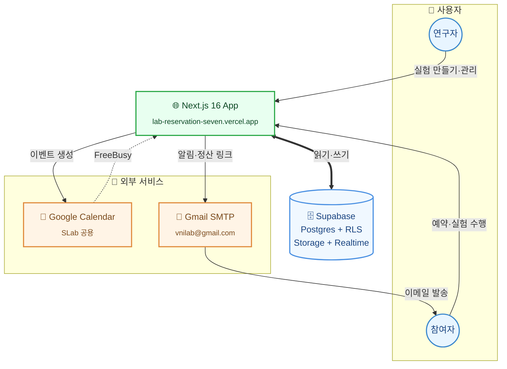
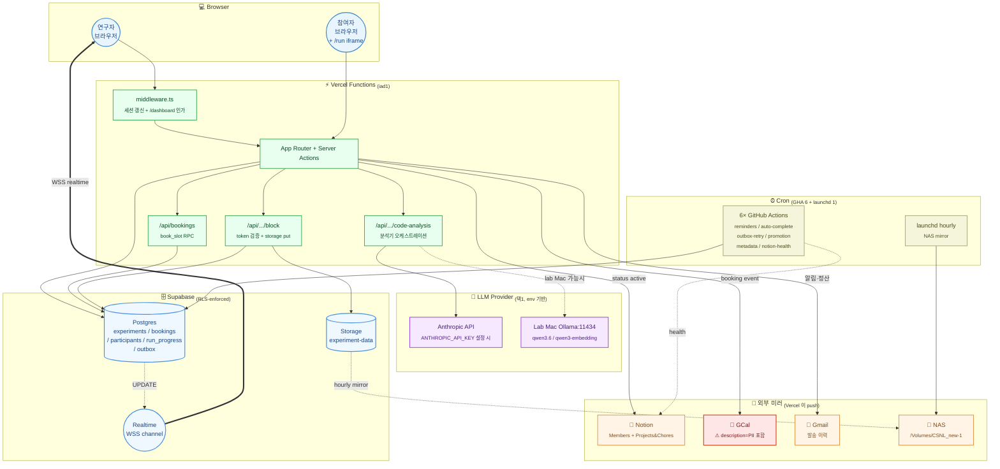
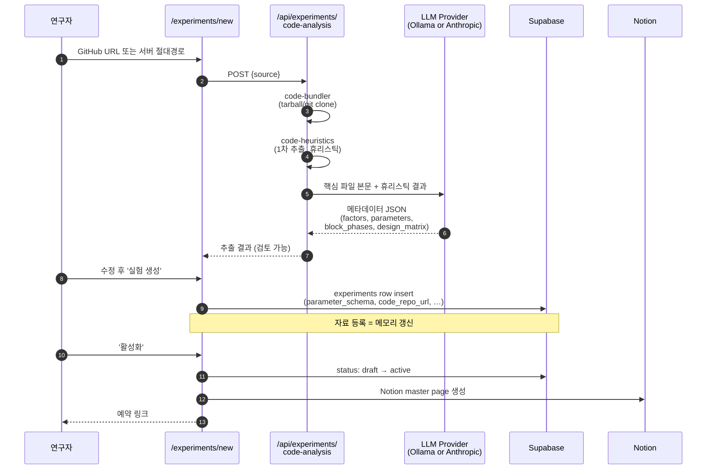
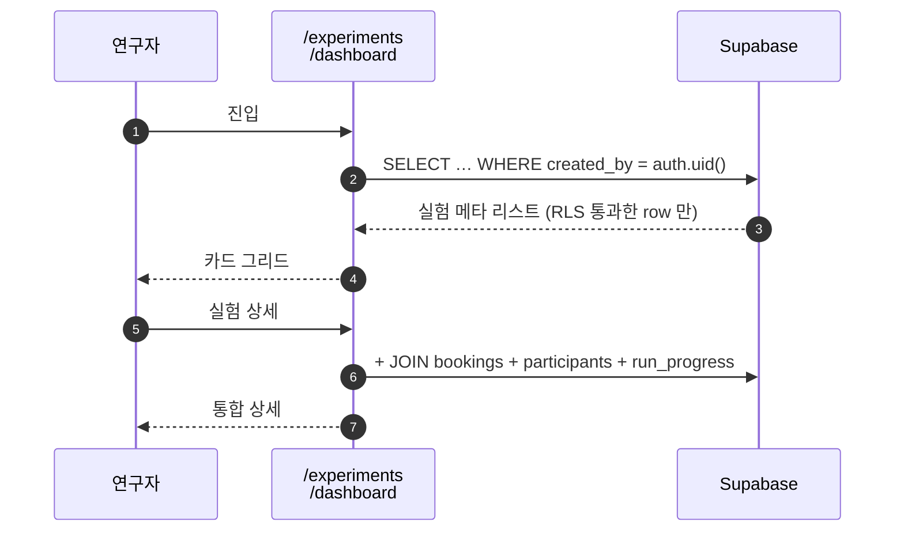
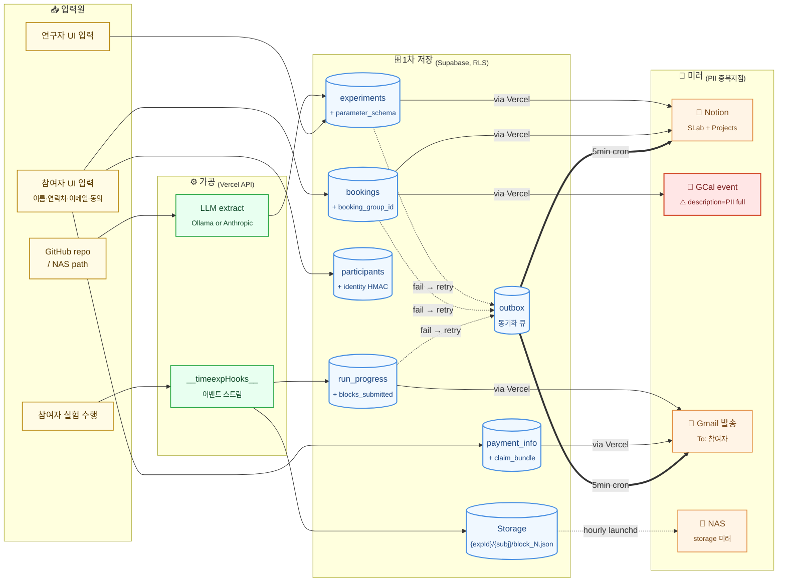

# CSNL 실험 운영 플랫폼 — Architecture

> **Audience**: external collaborators / grant reviewers.
> **Scope**: `lab-reservation` (실험 예약·온라인 실험 런타임) + `csnl-ops` (운영지식 baseline) + 외부 SaaS + lab Mac local infra.
> **Last updated**: 2026-05-01

---

## Operational reality (먼저 읽어 주세요)

| 항목 | 사실 |
|---|---|
| **Project age** | 2026-04-15 첫 커밋. 2026-05-01 기준 16일차, 134 커밋. |
| **Bus factor** | 1 (JOP). 운영 핸드오버 문서 미작성. |
| **Validation** | TimeExpOnline1_demo 1개 실험으로 ideal-observer 32회 e2e 통과 (bias ±2.3 ms). 다른 실험 패러다임에서의 검증 없음. |
| **Free-tier 의존** | Supabase Free / Vercel Hobby / Gmail 앱 비밀번호 / GitHub Free Actions. 참여자 200~300명 / 월 100GB-hr 부근에서 유료 전환 필요. |
| **2026-05-01 직전에 fix 한 것** | `experiments.lab_id NOT NULL` 누락, slot picker 의 과거 시간 표시, Supabase Realtime websocket 인증 (env 의 trailing newline), GitHub→Vercel auto-deploy gate (`requireVerifiedCommits` 임시 해제). 즉 핵심 데이터 경로 + 실시간 채널 + 자동 배포 모두 *지난 24시간* 안에 손이 갔음. |
| **연구노트 (why?)** | 자동 인덱싱 미구현. 실험 폼의 자유 텍스트 + Notion Projects 페이지 링크로 우회. |

---

## 1a. System Architecture — 사용자가 보는 것

5개 외부 노드. 연구자/참여자 → Vercel 앱 → Supabase. 외부로는 Google Calendar (이벤트 + FreeBusy) 와 Gmail (알림) 둘만.

## 1b. System Architecture — 내부 메커니즘

**핵심 정정:**
- `code-bundler.ts`, `code-heuristics.ts`, `code-ai-analyzer.ts` 는 **Vercel server-side 모듈** (`src/lib/experiments/*`). lab Mac 에 있는 건 **Ollama 인스턴스 1개**뿐.
- LLM provider 는 환경변수로 분기: `LLM_PROVIDER=ollama` (lab Mac LAN 접근 가능할 때) OR `ANTHROPIC_API_KEY` 설정 (cloud). **production 배포본은 사실상 Anthropic 사용**.
- Supabase ↔ Notion / GCal / Gmail 동기화는 DB 트리거가 아니라 **Vercel API/Server Action** 에서 명시적으로 push.

---

## 2. User Flow — 자료 업로드 시 vs 검색 시

### 2-A. 업로드 (실험자가 새 실험 등록)

**한계:**
- LLM 추출 정확도는 검증 안 됨. 휴리스틱이 잡지 못한 부분에서 hallucination 가능.
- 외부 LLM 호출은 `ANTHROPIC_API_KEY` 가 설정된 상태에서 발생 — 코드 본문이 외부로 나간다는 의미.

### 2-B. 검색 (등록된 실험의 메타데이터 조회)

**현재 검색 한계:**
- 자유 텍스트 / 의미 검색 없음 (필터·정렬만).
- cross-experiment 메타데이터 조회 미구현 (예: "thetaLabel 변수를 쓰는 다른 실험"을 못 찾음).
- 향후 `qwen3-embedding` + Supabase `pgvector` 로 의미 검색 가능 (planned).

---

## 3. Data Flow

### 동기화 보장
- **outbox 패턴**: 외부 동기화 실패 시 `outbox` 테이블에 적재 → `outbox-retry-cron` 5분마다 재시도 → 한계 도달 시 대시보드 KPI.
- **Realtime**: `experiment_run_progress` UPDATE → Supabase realtime channel → `/live` 페이지 즉시 반영 (browser ↔ Supabase WSS, Vercel 거치지 않음).
- **NAS 미러**: 단일 lab Mac launchd. 오프사이트 백업 없음.

---

## 4. PII 흐름 (별도 강조)

참여자 PII (이름·이메일·전화·생년월일) 의 6개 저장지점:

| 저장지점 | 무엇이 들어가나 | 접근 통제 |
|---|---|---|
| Supabase `participants` | 전체 PII (전화·이메일 평문, RRN 은 HMAC) | RLS — researcher 본인 + admin |
| Supabase `bookings` | participant_id (참조) | RLS |
| **Google Calendar event description** | ⚠ **이름 + 이메일 + 전화** 평문 | SLab 캘린더 공유권자 모두 |
| Gmail 발송 이력 | 받는사람=참여자 이메일, 본문에 이름·일정 | `vnilab@gmail.com` 단일 메일박스 (앱 비밀번호) |
| Notion Members DB | 참여자 식별번호 + 클래스, **PII 평문은 미저장** | Notion 워크스페이스 멤버 |
| NAS (`/Volumes/CSNL_new-1`) | Supabase Storage 의 데이터 미러. block_N.json 자체엔 PII 없음 | 랩 LAN |

**가장 큰 노출 surface 는 GCal 이벤트 description**. 캘린더 공유 정책을 좁히는 것이 PII 보호 효과 가장 큼.

---

## 5. 보안 메모

| 항목 | 사실 (정정·보강) |
|---|---|
| **Anti-LLM honeypot** | `src/components/run/run-shell.tsx:531-545` 의 aria-hidden offscreen `
` 에 `hazelnut-97f3` 단일 문자열. API 측 (`/screener`, `/block`) 에서 응답 본문이 이 단어를 포함하면 플래그. **단순 tripwire** — DOM 선택자로 offscreen 노드 거르는 봇은 통과. "보안 통제"가 아니라 "성의 없는 자동화 detection". |
| **RLS** | `supabase/migrations/*` 에 `ENABLE ROW LEVEL SECURITY` 25건. 모든 user-facing 테이블 보호. **단**, `outbox` 등 cron-internal 테이블의 RLS 설정은 별도 확인 필요. |
| **GCal title** | `[이니셜] 프로젝트/Sbj N/Day D` — PII 없음. ✓ |
| **GCal description** | ⚠ 이름·이메일·전화 평문. SLab 캘린더 공유권자는 모두 열람 가능. |
| **결정적 RNG** | `mulberry32(uint32(SHA-256(bookingId).slice(0,4)))` — 4 byte (32 bit) prefix. 같은 booking_id → 같은 schedule. 재현성 OK, 그러나 booking_id 알면 schedule 복원 가능 (적대적 모델 없음). |
| **RUN_TOKEN_SECRET** | 미설정 시 `REGISTRATION_SECRET` → `SUPABASE_SERVICE_ROLE_KEY` 로 silent fallback (`src/lib/experiments/run-token.ts:23-44`). 즉 service-role 키 회전 시 in-flight 토큰 모두 무효. **rotation 절차 미정의**. |
| **Secret 보관** | Vercel env (production). 로컬 lab Mac `.env.local`, `.env.vercel.local`, `.env.vercel.prod` (gitignore 됨). lab Mac 침해 = 모든 키 노출. Notion·Gmail 키는 별도 회전 절차 없음. |
| **Token validation 5 paths** | OK / SHAPE / SIGNATURE / BOOKING_MISMATCH / EXPIRED. SHAPE/SIGNATURE/BOOKING_MISMATCH 는 `err: invalid` 로 collapse (어느 단계 실패인지 leak 안 함). EXPIRED 만 distinct. ✓ |

---

## 6. 무료 tier 임계점 (실측 아닌 추정)

| 서비스 | 한도 | 임계 도달 추정 |
|---|---|---|
| Supabase Free | DB 500 MB / Storage 1 GB / egress 2 GB-mo / 7일 inactivity 자동 pause | 참여자 ~300명 + block 데이터 누적 시 storage 먼저 소진. 7일 inactivity 위험은 cron 가 매시간 ping 하므로 낮음. |
| Vercel Hobby | 100 GB-hr functions/mo · **non-commercial** · 100GB egress | 참여자 100명 × 5 sessions × 40min runtime = ~333 hr → 함수 실행시간 임계. **상업 사용 시 라이선스 위반**. |
| Gmail SMTP (앱 비밀번호) | 500 명 / 24h · 100 메일 / 1일 (개인) | 참여자 50명 / 일 + 알림 cron 2회 = 임박. 다회차 reminders 쌓이면 위험. |
| GitHub Actions Free | 2000 min/mo · public repo 무제한 | repo public 이라 cron 6개 무료. ✓ |
| **Cumulative**: 실 운영 기준 **참여자 ~150명 / 월** 부근에서 유료 마이그레이션 고려 시작. |

---

## 7. 관리 중인 도구·리포 인벤토리

### 7.1 Repositories (CSNL-vnilab GitHub org)

| 이름 | 역할 | 상태 |
|---|---|---|
| `Exp_Platform_by_Joonoh` (=lab-reservation) | 본 시스템. Vercel 호스팅. | 🟢 production |
| `csnl-ops` | 운영지식 (캘린더·발표자료·연간일정) Supabase 통합 baseline. 현재 README 만 있음. | 🟡 baseline |

### 7.2 MCP Servers (user-scope)

| 이름 | 패키지 | 역할 |
|---|---|---|
| `chrome-devtools` | `chrome-devtools-mcp@latest` | UI-driven 테스트. JOP의 로그인 Chrome 에 attach. |
| `drawio` | `@drawio/mcp` | `.drawio` 다이어그램 생성. 2026-05-01 등록. |

### 7.3 외부 SaaS

| 서비스 | 식별자 | 역할 |
|---|---|---|
| Supabase | `qjhzjqkrbvsnwlbpilio.supabase.co` | DB + Auth + Storage + Realtime |
| Vercel | project `prj_rcNGgrYjknxVnebNN5xPa1rHkGtL` (team `vnilab-9610s-projects`) | Next.js 호스팅 + Functions + GH webhook 자동 업로드 |
| Google Calendar | `dvjmpc33e56l0euaq4c0dekvu4@group.calendar.google.com` | SLab 공용 캘린더 |
| Notion | Members `94854705-…`, Projects&Chores `76e7c392-…` | 시각화 + 자유 메모 |
| Gmail | `vnilab@gmail.com` | 알림·정산 발송 (앱 비밀번호) |
| GitHub | `CSNL-vnilab/*` | 코드 호스팅 + Actions cron |

### 7.4 Local Infra (lab Mac)

| 컴포넌트 | 용도 |
|---|---|
| Ollama (`localhost:11434`) | `qwen3.6:latest` (24 GB), `qwen3-embedding:8b`, `bge-m3`, `glm-ocr` 등. 코드 분석 fallback. |
| launchd | 매시간 Supabase Storage → NAS 미러. |
| NAS (`/Volumes/CSNL_new-1`) | 데이터 백업 (단일 사이트). |

### 7.5 Cron (총 7개 = GitHub Actions 6 + lab Mac launchd 1)

| 워크플로우 | 위치 | 주기 | 역할 |
|---|---|---|---|
| `reminders-cron` | GHA | 매 5분 | 전날 18:00 / 당일 09:00 알림 |
| `auto-complete-cron` | GHA | 매일 02:15 KST | 정원 찬 실험 status 전환 |
| `outbox-retry-cron` | GHA | 매 5분 | Notion/Gmail/GCal 동기화 재시도 |
| `promotion-notifications-cron` | GHA | 매일 | 참여자 클래스 승급 알림 |
| `metadata-reminders-cron` | GHA | 매일 | 활성화 직전 메타 누락 알림 |
| `notion-health-cron` | GHA | 매시간 | Notion DB 스키마 드리프트 검출 |
| `nas-mirror.plist` | lab Mac launchd | 매시간 | Supabase Storage → NAS 복사 |

**모니터링 부재**: 6개 GHA 가 silent 실패해도 알림 없음. dead-man-switch 미구현.

---

## 8. 미구현·향후 작업

| 항목 | 메모 |
|---|---|
| 연구노트 (why?) → MD 자동 인덱싱 | 현재 수동 텍스트 + Notion 페이지 링크 우회. |
| 의미 검색 (pgvector + qwen3-embedding) | 현재 텍스트 필터만. |
| `csnl-ops` 운영 DB 통합 | baseline 만 있음. 캘린더·발표자료·연간일정 통합 스키마 미작성. |
| GPG 서명 + `requireVerifiedCommits` 재활성 | 2026-05-01 일시 해제. lab Mac GPG 셋업 후 재활성 권장. |
| Cron 모니터링 (dead-man-switch) | 미구현. |
| 핸드오버 문서 | 미작성. bus factor 1. |
| GCal description PII 축소 | 현재 이름·이메일·전화 평문. 마스킹 또는 별도 시스템 분리 필요. |
| RUN_TOKEN_SECRET rotation 절차 | 미정의. |

---

*Diagrams generated with Mermaid. Source-verified against `src/lib/experiments/llm-provider.ts`, `src/lib/services/booking.service.ts`, `src/lib/experiments/run-token.ts`, `public/demo-exp/timeexp/main.js`, `supabase/migrations/*.sql`, `.github/workflows/*-cron.yml` on 2026-05-01.*
