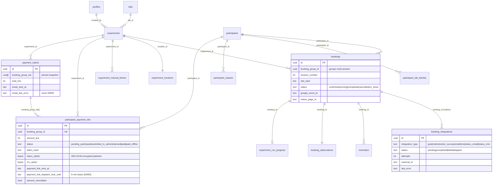
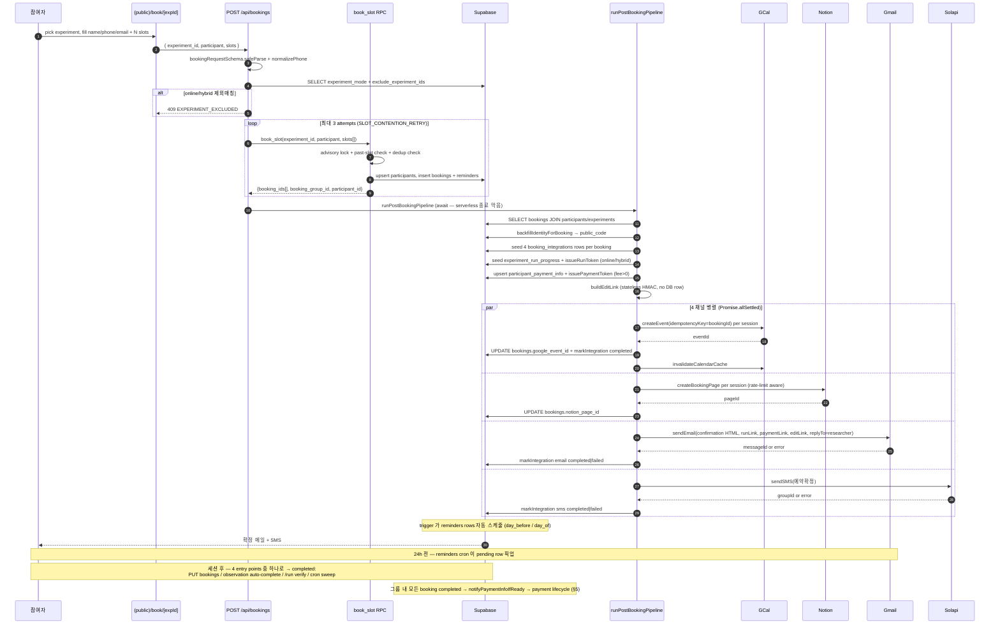
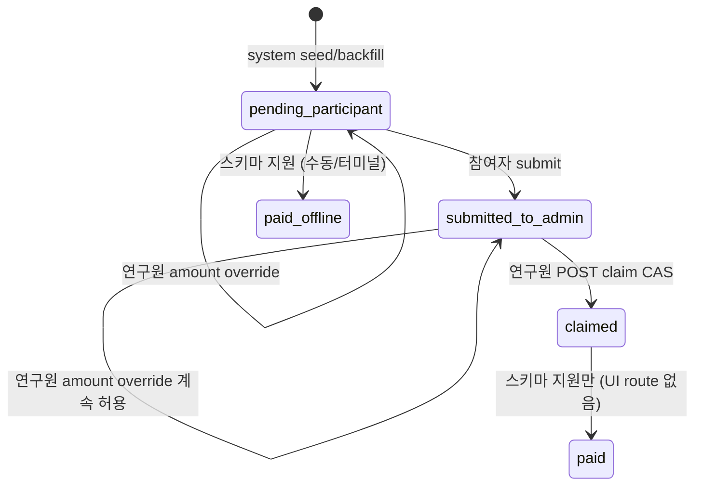

# lab-reservation Architecture Blueprint (2026-05-29)

## 1. Elevator pitch

CSNL 의 in-house 참여자-예약 플랫폼. 한 명의 한국 인지신경과학 연구실이 사용 — 연구원이 실험을 등록하고, 참여자가 offline/online 세션을 self-book 하고, 사후 행정 (reminders, Notion 미러, Google Calendar 예약, 완료 검증, RRN/계좌 수집, 행정 청구 번들 발송) 을 한 플랫폼에서 처리. **Next.js 14 App Router** on **Vercel Hobby**, **Supabase** (Postgres + Storage + Auth), 4 개 외부 SaaS gateway (Google Calendar, Notion, Gmail, Solapi SMS), ~9 개 GitHub Actions + Vercel Cron 으로 일상 운영. **Bus factor = 1** (JOP). 모든 설계는 "scale" 이 아닌 "공유 inbox 두 사람이 유지 가능" 에 최적화.

## 2. Stakeholders & their interfaces

| Actor | Surface | What flows in | What flows out |
|---|---|---|---|
| **참여자** | `(public)/book/[experimentId]`, 확정 이메일, `(public)/booking-edit/[token]`, `(public)/payment-info/[token]`, `(public)/run/[bookingId]` | 이름/전화/이메일/생년월일, RRN+계좌+서명+통장사본, 완료코드, reschedule/cancel 의도 | 확정 메일 + SMS, reminder, run 링크, 정산 링크, 상태변경 메일/SMS |
| **연구원** | `(admin)/experiments/...`, dashboard, participants, schedule (Supabase 쿠키 인증) | 실험 config, status flip, manual block, pilot toggle, 청구번들 다운로드, 행정메일 confirm | bookings/participants/payment_info 읽기, ZIP 다운로드, auto-promotion + metadata-reminder 메일 수신 |
| **관리자** | `(admin)/users`, `(admin)/locations`, registration approve/reject | 역할 bump, location seed, 가입 승인 | participant_class audit 가시성 |
| **행정** | Gmail inbox (`LAB_ADMIN_EMAIL`) | n/a | 한 `payment_claims` row 당 한 메일 + 3 xlsx + 1 zip 첨부 |
| **Cron** | `Authorization: Bearer $CRON_SECRET` → `/api/cron/*`, `/api/notifications/reminders` | 시계 tick | DB sweep + email/SMS/Notion 발송 |
| **외부: GCal** | service account, calendar id env | 이벤트 id (create/delete) | freebusy 윈도우 |
| **외부: Notion** | integration token + database id, rate-limit-aware | 페이지 생성 결과 | (단방향 미러, 응답 없음) |
| **외부: Gmail SMTP** | `GMAIL_USER` + app password (nodemailer) | messageId | (응답 없음, inbound webhook 없음) |
| **외부: Solapi SMS** | API key/secret HMAC | groupId | (응답 없음) |

참여자 + 연구원 두 surface 가 매일 사용. 나머지는 연간 config (관리자) or fire-and-forget (cron + 외부).

## 3. The data model



**Maintainer 가 알아야 할 핵심**:
- **Dispatch-lock 컬럼은 `participant_payment_info` 에만 존재** (booking_integrations 에는 없음). **두 개의 다른 outbox 메커니즘이 공존** (§10).
- **`booking_group_id`** 는 별도 row 아님 — 한 booking 의 row 들에 stamp 된 UUID. payment-info / booking-edit token scope / renumber / reschedule propagation 의 자연 aggregate id.
- **append-only 테이블**: `participant_class_audit`, `notion_health_state`, `class_promotion_notifications`, `metadata_reminder_log` — 절대 in-place update 안 함.

## 4. Booking lifecycle



**Critical implementation details**:
- 파이프라인이 route 에서 `await` 되는 이유: Vercel serverless 인스턴스는 응답 전송 즉시 terminate. 백그라운드 queue 없음. 실패는 `booking_integrations.status='failed'` 에 안착 → **outbox-retry cron** (30 분 주기) 이 `claim_next_outbox_retry` RPC (migration 00037) 로 replay.
- **4 개 entry points** 가 모두 `notifyPaymentInfoIfReady` 로 수렴: PUT bookings status flip, observation auto-complete, /run verify auto-complete, cron sweep. 각각 fire-and-forget. **dispatch lock** (migration 00053) 이 SMTP 호출 window 안에서 2-4 copy 가 가는 것 방지.
- `renumberSessionsInGroup` (`booking.service.ts:970`) — 모든 reschedule 후 active 세션을 chronological order 로 재번호. cancelled/no_show 는 **의도적으로** renumber 안 함.

## 5. Payment lifecycle

```mermaid
sequenceDiagram
  autonumber
  participant P as 참여자
  participant R as 연구원
  participant Notify as notifyPaymentInfoIfReady
  participant DB as Supabase
  participant Gmail
  participant PIPage as /payment-info/[token]
  participant Submit as POST /payment-info/:token/submit
  participant Storage as Supabase Storage
  participant Claim as POST /payment-claim
  participant Bundle as buildClaimBundle
  participant ClaimEmail as /payment-claim/[claimId]/email

  Note over DB: 그룹 내 모든 booking 'completed' (§4)
  Notify->>DB: SELECT payment_info + group bookings + experiments/participants
  Notify->>Notify: guards (already_sent, amount_zero, not_all_completed, no_recipient)
  Notify->>DB: UPDATE dispatch_lock_until=now+5min CAS
  alt lock_held (race)
    Notify-->>Notify: return — 다음 trigger or cron tick 재시도
  end
  Notify->>DB: post-lock re-fetch amount/auto_send/status (C8/C9 fix)
  Notify->>Notify: token strategy (preserve if first_opened_at + cipher OK; else rotate)
  Notify->>DB: UPDATE token_hash + token_cipher (lockstep)
  Notify->>Gmail: sendEmail(payment-info link, researcher Reply-To)
  Gmail-->>Notify: messageId
  Notify->>DB: UPDATE payment_link_sent_at + clear lock (atomic)
  Gmail-->>P: "정산 정보 입력해 주세요" + /payment-info/[token]

  P->>PIPage: open link
  PIPage->>DB: POST /touch (stamp first_opened_at)
  P->>PIPage: 이름/이메일 override, RRN, 계좌, 서명, 통장사본
  PIPage->>Submit: POST { encrypted RRN, bank, signature dataURL, bankbook dataURL }
  Submit->>Submit: verifyPaymentToken HMAC + lookup by token_hash
  Submit->>DB: slot_end <= now for ALL sessions in group
  Submit->>Submit: validateRrn + magic-byte verify PNGs
  Submit->>Storage: upload signature → participant-signatures
  Submit->>Storage: upload bankbook → participant-bankbooks
  Submit->>DB: UPDATE status='submitted_to_admin' + rrn_cipher + token 폐기 (CAS)
  Submit-->>P: 200 OK

  Note over R,Claim: 연구원이 실험 payment-info 페이지 → "참여자비 청구" 클릭
  R->>Claim: POST /api/experiments/:exp/payment-claim
  Claim->>DB: fetchClaimRows (status='submitted_to_admin')
  Claim->>DB: CAS flip submitted_to_admin → claimed per row
  Claim->>DB: post-CAS refresh amount_krw (A2/H21 fix)
  Claim->>Bundle: buildClaimBundle(rows)
  Bundle->>Storage: bounded-concurrent download signatures + bankbooks (limit=8)
  Bundle->>Bundle: buildIndividualForm × N + buildUploadForm + 통장사본.zip
  Bundle-->>Claim: zipBuffer
  Claim->>DB: INSERT payment_claims(booking_group_ids[], total_krw)
  Claim-->>R: download attachment

  Note over R,ClaimEmail: 별도 명시 클릭 → 행정 email
  R->>ClaimEmail: GET (preview) → modal
  R->>ClaimEmail: POST {recipientEmail, confirm:true}
  ClaimEmail->>Bundle: fetchClaimRowsByClaimId (status-agnostic)
  ClaimEmail->>Storage: re-download assets
  ClaimEmail->>Gmail: sendEmail to LAB_ADMIN_EMAIL, cc=researcher, replyTo=contact_email
  Gmail-->>ClaimEmail: messageId
  ClaimEmail->>DB: email_sent_at + message_id (00058) OR email_last_error (00059)
  Gmail-->>행정: 청구 메일 + bundle
```

**Key invariants**:
- 행정 메일은 **`/payment-claim` 에서 자동 발송 안 됨**. 연구원이 `/payment-claim/[claimId]/email` 을 명시적으로 POST. GET 은 preview only. Belt-and-suspenders 로 zod schema 의 `confirm: true` literal.
- `fetchClaimRowsByClaimId` 는 status-agnostic (`payment_claims.booking_group_ids[]` 로 resolve) — `claimed`/`paid` 후에도 email path 동작.
- Bundle 생성은 **단일 source of truth** in `src/lib/payments/claim-bundle.ts`. 다운로드 ZIP 과 행정 email 모두 reuse.

## 6. Payment status FSM



**Locks at each state**:
- `pending_participant`: amount 편집 가능, token 유효
- `submitted_to_admin`: 참여자 편집 차단, resend 차단, amount 여전히 편집 가능
- `claimed`: amount PATCH 거부 (status filter), claim email/export 만 가능
- `paid`: enum 에 있지만 UI path 없음 — 행정 disbursement 가 앱 외부에서

## 7. Cron topology

| Schedule (UTC) | Endpoint | Owner workflow | What touches | External calls |
|---|---|---|---|---|
| `*/15 * * * *` | `/api/notifications/reminders` | `reminders-cron.yml` (또는 vercel.json) | `reminders.status='pending' AND scheduled_at<=now` (limit 50) | Gmail + Solapi |
| `*/30 * * * *` | `/api/cron/outbox-retry` | `outbox-retry-cron.yml` | `claim_next_outbox_retry({gcal,notion,notion_survey,sms,email})` → 4 retry services; `notion_health_state.check_type='outbox_retry_sweep'` 기록 | 4 채널 모두 |
| `*/30 * * * *` | `/api/cron/promotion-notifications` | `promotion-notifications-cron.yml` | `pending_promotion_notifications()` → 연구원 메일 1 통 per (audit × researcher) | Gmail |
| `15 17 * * *` | `/api/cron/auto-complete-bookings` | `auto-complete-cron.yml` (or vercel.json) | `auto_complete_stale_bookings(grace_days)` → `sweepPaymentInfoNotifications` (limit 50) | Gmail (indirect) |
| `0 16 * * *` | `/api/cron/notion-health` | `notion-health-cron.yml` | `diffNotionSchema` → `notion_health_state.check_type='schema_drift'` 추가 | Notion |
| `0 0 * * 1` | `/api/cron/metadata-reminders` | `metadata-reminders-cron.yml` | empty `code_repo_url / data_path / pre_experiment_checklist` 가진 experiments; `metadata_reminder_log` 로 7d rate-limit | Gmail |
| `5 */6 * * *` | (read-only) | `prod-smoke.yml` | 7 cron URL 을 secret 없이 hit → 401 확인 | — |

**Load-bearing 분석**:
- **`outbox-retry`** = 모든 외부 integration 의 유일 catch-up. 멈추면 모든 `booking_integrations.status='failed'` 영구 정체.
- **`auto-complete-bookings`** = payment dispatch closure 의 유일한 경로 — 연구원이 manual `completed` 안 하면 이게 없으면 `notifyPaymentInfoIfReady` 영원히 trigger 안 됨.
- **`reminders`** = 참여자 출석률의 load-bearing — UI-driven "reminder 발송" 버튼 없음.
- **`promotion-notifications`** = 연구원이 참여자 Royal 등급 변동을 알 수 있는 유일한 path.

자세히는 [`docs/cron-runbook.md`](../cron-runbook.md).

## 8. Auth / token map

```mermaid
graph TD
  subgraph "Cookie-bound"
    Supa[Supabase Auth session cookie]
    SS[supabase/server.ts createClient]
    Supa --> SS
    SS -->|auth.getUser() in every (admin) route| ROLE[profiles.role check]
  end

  subgraph "Service-role"
    SRK[SUPABASE_SERVICE_ROLE_KEY]
    AC[supabase/admin.ts createAdminClient]
    SRK --> AC
    AC -->|RLS bypass| ANY[any table]
  end

  subgraph "HMAC-signed tokens"
    PT[Payment token<br/>payments/token.ts<br/>TTL 60d<br/>hash in participant_payment_info<br/>cipher 도 저장 - re-send용]
    BET[Booking-edit token<br/>booking-edit/token.ts<br/>TTL 60d<br/>STATELESS - no DB row]
    RT[Run token<br/>experiments/run-token.ts<br/>TTL 14d<br/>hash in experiment_run_progress]
  end

  subgraph "Cron secret"
    CS[CRON_SECRET env, ≥32 chars]
    CSH[auth/cron-secret.ts]
    CS --> CSH
  end

  R[연구원] -->|login form| Supa
  R -->|(admin)/*| SS
  A[관리자] --> Supa
  P[참여자] -->|book form, no auth| BookAPI[POST /api/bookings]
  P -->|email link| PT
  P -->|email link| BET
  P -->|email link| RT
  GH[GitHub Actions] -->|x-cron-secret| CSH
  VC[Vercel Cron] -->|Authorization Bearer| CSH
  CSH -->|on success| CronR[/api/cron/*]
```

**Notes**:
- 3 HMAC token 모두 같은 `${id}.${issuedAtMs}.${nonce}.${sig}` shape 공유. `PAYMENT_TOKEN_SECRET → RUN_TOKEN_SECRET → REGISTRATION_SECRET → SUPABASE_SERVICE_ROLE_KEY` fallback chain. 4 개 token system 의 near-identical 120 LOC 가 [hidden-couplings § #23](./hidden-couplings.md) 의 single rotation invalidation 위험을 만듦.
- 연구원 login 이메일은 **synthetic** (`<username>@lab.local`). 실제 Reply-To 는 `profiles.contact_email`.

## 9. External gateways

| External | Gateway file | Retry inside | Failure DB-side | Notes |
|---|---|---|---|---|
| **Google Calendar** | `src/lib/google/calendar.ts` (`withRetry`: 2 attempts, 400ms backoff, 429/500/502/503/504/network only) | `markIntegration("gcal","failed",last_error)` in `runGCal`; outbox-retry replays via `runGCalRetry` (cap 5 attempts) | freebusy 캐시 + 403/404 시 `freebusy.query` fallback | `idempotencyKey: bookingId` on createEvent → 안전한 retry |
| **Notion** | `src/lib/notion/client.ts` + `rate-limit.ts` (Retry-After 준수, 2 internal retry) | `markIntegration("notion","failed")`; `runBookingNotionRetry` / `runObservationNotionRetry` | `notion_health_state` | 3 rps sustained; one-way mirror |
| **Gmail SMTP** | `src/lib/google/gmail.ts` (nodemailer, **retry 없음**) | `markIntegration("email","failed")` OR `payment_link_last_error`; `runEmailRetry` (confirmation only) | 없음 | Single shared lab inbox. `replyTo`=`profiles.contact_email` |
| **Solapi SMS** | `src/lib/solapi/client.ts` (HMAC-SHA256, **retry 없음**) | `markIntegration("sms","failed")`; `runSMSRetry` | 없음 | `to` validation 없음 (caller 가 정규화) |
| **Supabase Storage** | `claim-bundle.downloadClaimAssets` (bounded concurrent, limit 8) | 에러 log + swallow | n/a | 실패한 bankbook 다운로드는 ZIP 에 silent empty slot |

## 10. Currently broken / fragile

**Known broken**:
- **CI migration gate** is informal — `ops-playbook.md` 의 "Last applied" 줄 수동 관리; **9 개 pending migration** (00058–00065) 누적
- **GitHub→Vercel auto-deploy** 가끔 flaky — webhook 진단: `curl … /v9/projects/{id}?teamId={team} | jq .link`

**Fragile (two-of-the-same-thing)**:
- **Two outbox mechanisms in parallel**:
  1. `booking_integrations` rows (gcal/notion/email/sms, per booking) — outbox-retry cron + `claim_next_outbox_retry` RPC
  2. `participant_payment_info.payment_link_*` columns (per booking_group) — `sweepPaymentInfoNotifications` + 4 entry points 직접 호출
  Dispatch lock (00053) 이 후자의 race 때문에 추가됨; 전자는 RPC-level FOR UPDATE SKIP LOCKED 라 필요 없었음. 새 email type 추가 시 drift 가 악화될 위험.

- **4 entry points → 1 notify**: `notifyPaymentInfoIfReady` — PUT bookings, observation auto-complete, /run verify, cron sweep. Dispatch lock 이 오늘 우리를 구함; 미래의 "5번째 entry point" 가 lock 우회하면 silent multi-send.

- **Email retry intentionally omits runLink/paymentLink** — HMAC token rotation 이 invalidate 시킴. 첫 시도 실패 → retry 메일 받은 참여자는 degraded 경험.

- **Cloudflare 잔재**: `D` 상태의 `open-next.config.ts`, `proxy.ts`, `wrangler.jsonc` (working tree). `DEPLOY.md` 는 2026-05-29 commit 으로 Vercel-only 로 재작성됨.

- **Reschedule legacy path**: `runReschedulePipeline` 의 atomic vs legacy 분기 — 후자는 "DB updated, GCal not yet" drift window.

- **Booking-edit token has NO revocation** by design — 분실 노트북/사회공학 시 새 컬럼 필요.

**Tech debt**:
- `payment_claims.email_last_error` (00059) 은 00058 row 와 partial schema. 새 코드 둘 다 처리; 일회 backfill 필요.
- `notion-retry-cron.yml` 은 ops-playbook 의 cron-cutover log 에 deleted 라 적혀있지만 디렉토리에 여전. verify 후 prune 필요.

## 11. Where to look when X happens

| Symptom | First check | Then | Then |
|---|---|---|---|
| 확정 메일 미도착 | `booking_integrations` for booking, `integration_type='email'`, look at `status`/`attempts`/`last_error` | `status='failed' AND attempts<5` 면 다음 outbox-retry tick 대기 (30 min) | `runEmail` in `booking.service.ts:525`; Gmail app-password 유효성 |
| 정산 메일 미도착 | `participant_payment_info` for group: `payment_link_sent_at`, `payment_link_attempts`, `payment_link_last_error`, `payment_link_dispatch_lock_until` | lock 이 stale 이면 5 분 후 auto-expire | `POST /api/experiments/:exp/payment-info/:bgId/resend` 로 replay |
| 회차 번호 틀림 | group 안 bookings 를 `slot_start` 순으로 — `session_number` 와 비교 | `renumberSessionsInGroup` in `booking.service.ts:970` — 마지막 reschedule 후 실행 확인 | active status 만 renumber; cancelled/no_show 는 의도적으로 보존 |
| 캘린더 이벤트 누락 | `booking_integrations` row `integration_type='gcal'`, `external_id` | `withRetry` in `calendar.ts` 는 2 attempts × 400ms 만 | 4 entry points 중 하나가 gcal write skip 했을 수 있음; `runGCal` in `booking.service.ts:359` + reschedule legacy 분기 점검 |
| Notion row 누락 | `notion_health_state` 최근 `schema_drift` row | `booking_integrations.status='failed' AND integration_type='notion'` — outbox-retry 가 처리 (max 5) | 실험 디테일 페이지의 "Notion 재동기화" 버튼 |
| 행정 메일 미발송 | `payment_claims.email_sent_at` + `email_message_id` + `email_last_error` | 연구원이 실제로 POST 했는지 (preview GET ≠ send) | `fetchClaimRowsByClaimId` 는 status-agnostic 이라 재전송 안전 |
| Reminder 미발사 | `reminders` row: `status` + `scheduled_at` + `channel` | reminders cron 15min 간격, GH Actions run history | `processReminders` in `reminder.service.ts:43` — bounded to 50 rows |
| Cron 이 401 반환 | GH Actions log 의 `secret_length=` (must ≥ 32) | Vercel `CRON_SECRET` env == GH secret | `cron-secret.ts:14` MIN_SECRET_LENGTH=32 |
| Migration 안 적용됨 | `docs/ops-playbook.md` § "Migration ordering rule" | `node scripts/migration-status.mjs` + `node scripts/apply-migration-mgmt.mjs <file>` | Supabase Management API 429 면 60-90s backoff |
| 참여자 BLACKLISTED | `participant_classes` + `participant_class_audit` for participant in lab | `changed_kind` = manual vs auto + `reason` | RLS keeps audit 가시 admin/owner only |
| `book_slot` 가 SLOT_CONTENTION_RETRY | 두 참여자가 같은 slot race; API 가 3× backoff retry | `book_slot` RPC 의 advisory lock | `BOOKING_RETRY` constant |
| Auto-promotion 메일 누락 | `class_promotion_notifications` row 가 successful send 후 존재 | Cron 30 min 주기; `pending_promotion_notifications()` 가 audit×researcher 로 filter | transient SMTP error 는 `isTransientSmtpError` 가 detect 후 next tick retry |

## 12. Evolution / refactor roadmap (sketch)

자세히는 [`refactor-roadmap.md`](./refactor-roadmap.md). 요약:

**Phase A — Stop the bleeding** (1-2주):
- "Two outbox mechanisms" 통일 — `participant_payment_info.payment_link_*` 를 `booking_integrations` 의 `integration_type='payment_info_email'` row 로 통합 (key 는 `booking_group_id`)
- Cloudflare 잔재 (`D` 상태 파일들) commit으로 정리
- `ops-playbook.md` 의 "Last applied" 줄을 CI gate 화

**Phase B — Subsystem extraction** (3-4주):
- `src/lib/notify/` 추출 (all email/SMS templates + transports)
- `src/lib/outbox/` 추출 (retry services + claim helpers + dispatch-lock helpers)
- 공통 HTTP helper → `src/lib/http/`

**Phase C — Online runtime as separate subsystem** (4-6주):
- `online_runtime_config` + `experiment_run_progress` + `/run` + run-token → clean module
- ~~AI code-analysis (`src/lib/experiments/code-*` + ollama) → `src/lib/code-analysis/`~~ _(offline code-analysis 기능 자체가 제거됨 2026-07 — migration 00081. 이 추출 작업 불필요.)_

**Phase D — Observability** (ongoing):
- 단일 "events" append-only 테이블 — 모든 email/SMS/calendar/notion 가 기록
- `notion_health_state.check_type` enum 를 generic `health_event` 테이블로

**Phase E — Scale escape** (필요시):
- Vercel Pro 로 cron cap 해제
- Supabase pgbouncer / Supavisor pooling

---

## Pivotal files (다음 maintainer 가 순서대로 읽을 것)

1. `src/app/api/bookings/route.ts` (entry)
2. `src/lib/services/booking.service.ts` (1002 LOC — the spine)
3. `src/lib/services/payment-info-notify.service.ts` (485 LOC — dispatch-lock pattern)
4. `src/lib/payments/claim-bundle.ts` (single source of truth for bundle build)
5. `src/lib/services/payment-claim-email.ts` (행정 dispatch composition)
6. `src/app/api/cron/outbox-retry/route.ts` + the four `*-retry.service.ts` files (retry topology)
7. `supabase/migrations/00013_booking_integrations.sql`, `00051`, `00053`, `00054`, `00058`, `00059`, `00065` (outbox + dispatch lock + reschedule + claim email + amount override lineage)
8. `docs/ops-playbook.md` (prod URLs + migration ordering)
