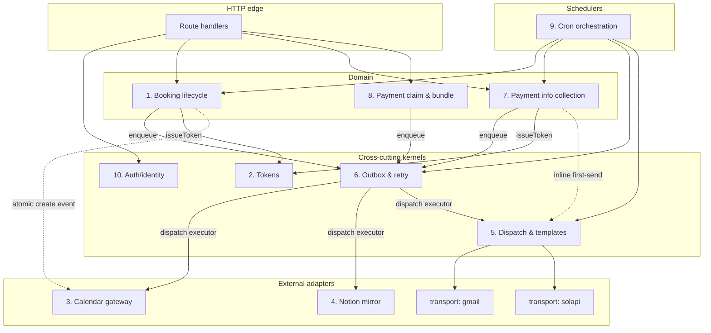
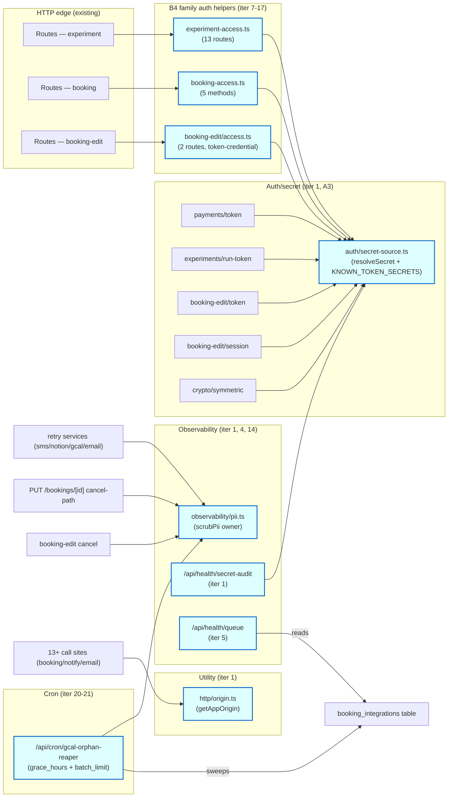

# Subsystem Boundaries (proposed)

> 2026-05-29 — Opus Boundary Architect 의 분석 결과.
> 10 specialized subsystem 으로 분해. 각 subsystem 의 책임 / entry / data ownership / forbidden / current code mapping / in-flight conflict.
> 코드가 명시하지 않지만 *원하는* boundary.

## Executive observation

코드베이스는 domain (gcal, notion, sms, payments) 과 event (post-booking, reschedule, status-change) 별로 누적되었고, *횡단 operations* (token issuance, outbox finalize, PII scrubbing, absolute URL origin, dispatch lock) 가 한 번도 consolidated 되지 않았습니다. `src/lib/services/` 디렉토리는 절반은 cohesive subsystem, 절반은 동사를 공유하는 파일 cohort. 모든 외부 integration 이 자체 `scrubPii`, 자체 retry shape, 자체 `finalize_*` RPC variant, 자체 claim shape 을 가짐. 의존성 방향은 대체로 깨끗 (route → service → adapter) 이지만 service tier 자체에 internal layering 이 없음: `email-retry` 와 `booking-creation` 이 같은 level 에 있지만 하나는 worker, 하나는 orchestrator.

코드가 원하는 boundary 한 줄로:

> *"Lifecycle transitions are pure DB; everything else is best-effort fanout against the same outbox row, replayable by exactly one worker."*

지금 코드의 절반은 이 룰을 따름 (`booking_integrations` + 4 retry workers + RPC claim) 이고 절반은 위반 (`payment-info-notify` 는 *다른* dispatch lock + 자체 attempts counter; `lab-notifications` 는 outbox 없이 fire-and-forget; `reminder.service` 는 자체 pending/sent state).

---

## 10 specialized subsystems

### 1. Booking lifecycle (DB-side state machine)

**Responsibility.** `bookings`, `booking_groups`, `experiment_run_progress` row 의 transition: create / reschedule / cancel / no_show / auto-complete / renumber sessions. Transition validation (admin auth 와 participant auth 가 같은 call 로 resolve); canonical row state 를 commit; *integration trigger event* 를 한 줄 emit (outbox row 작성, return). **SMTP, GCal, Solapi, Notion 직접 호출 금지.**

**Entry points.** `createBookingGroup`, `rescheduleBooking`, `cancelBooking`, `markBookingCompleted`, `renumberSessionsInGroup`, `autoCompleteStaleBookings` (cron-callable).

**Data owned.** `bookings`, `booking_groups`, `reminders` (scheduling rows, 전달은 아님), `experiment_run_progress`, `booking_observations` (row, Notion sync 는 아님). 유효한 status transition 의 DB 불변식 (현재 `VALID_TRANSITIONS` map at `src/app/api/bookings/[bookingId]/route.ts:22`).

**Forbidden.** `gmail` / `solapi` / `calendar` / `notion` import 안 함. HTML 문자열 build 안 함. SMS 목적으로 `participants.phone` read 안 함 — booking row 에 write 만.

**Current code mapping.**
- `src/lib/services/booking.service.ts:67-1002` — 3 file 로 split:
  - `booking-create.service.ts` (`runPostBookingPipeline` 의 DB-touching 전반)
  - `booking-reschedule.service.ts` (`runReschedulePipeline` 의 DB-touching 전반)
  - `booking-renumber.service.ts` (`renumberSessionsInGroup`)
- `runGCal`/`runNotion`/`runEmail`/`runSMS` 후반은 #5-8 로 이동.
- **Misfiled here**: `src/app/api/bookings/[bookingId]/route.ts:22-28` (transition map) — domain invariant 가 HTTP layer 에 inline. booking entity 옆으로.
- **Misfiled here**: `src/app/api/booking-edit/[token]/[bookingId]/reschedule/route.ts:120-237` 가 admin-PATCH `src/app/api/bookings/[bookingId]/route.ts:303-460` 의 *모든 라인* 을 duplicate. weekday check, capacity check, GCal busy check, pre-create event, DB update, renumber. 단일 `rescheduleBooking(bookingId, newSlotStart, newSlotEnd, actor)` 가 두 route 를 collapse.

**Conflict.** 🟡 `booking.service.ts` 와 `(admin)/experiments/[experimentId]/bookings/page.tsx` 둘 다 다른 세션 modified. Refactor 시 rebase 필요.

---

### 2. Token & verify-session (single token kernel)

**Responsibility.** HMAC-signed scoped tokens 의 단일 구현. 각 token: `(scope, scopeId)`, issued-at, nonce, TTL, fallback secret chain, hash-for-storage, optional scope-id expectation 으로 verify. Scope 마다 TTL + secret-env preference + optional revocation-check hook 등록. **오늘 이 책임은 4 file + ~440 LOC 의 near-identical crypto.**

**Entry points.** `issueToken({scope: "payment"|"run"|"booking-edit", scopeId, expectations?})`, `verifyToken(scope, token, {expectScopeId?, revocationCheck?})`, `hashToken`.

**Data owned.** rest 에 데이터 없음 (DB hash 컬럼은 scope 소유자에게: `participant_payment_info.token_hash`, `experiment_run_progress.token_hash`). 그러나 token *protocol* — wire format, key derivation precedence, error code taxonomy — 는 여기 독점.

**Forbidden.** DB read 안 함 (revocation check 는 caller 가 전달하는 callback). plaintext token log 안 함. 어떤 service module 도 의존하지 않음.

**Current code mapping.**
- Current: `src/lib/payments/token.ts` (120 LOC), `src/lib/booking-edit/token.ts` (114 LOC), `src/lib/experiments/run-token.ts` (124 LOC). 각각 `getKey()`, `b64url()`, `sign()`, 4-part shape, `MAX_AGE_MS` 정의. 의미 있는 차이: TTL (60d vs 14d) 와 revocation-check preference 만.
- Proposed: `src/lib/tokens/scoped-token.ts` (kernel) + 30-line registry `{payment: 60d, run: 14d, "booking-edit": 60d}`.

**Conflict.** 🟢 None — 이 file 들은 stable.

---

### 3. Calendar gateway

**Responsibility.** Google Calendar 와 대화하는 유일한 곳. idempotency-key handling, 409-recovery, freebusy cache invalidation, busy-window query 구현. domain-shaped API (`createBookingEvent(booking, calendar)`, `deleteBookingEvent`, `checkBusy(window, calendar)`) — Google API 아님.

**Entry points.** `createBookingEvent`, `deleteBookingEvent`, `checkBusyForReschedule`, `invalidateCachedAvailability`.

**Data owned.** `freebusy_cache`. `GOOGLE_CALENDAR_ID` env. service-account creds.

**Forbidden.** *Retry 할지* 결정 안 함 (#8 책임). `booking_integrations` row 표시 안 함. `bookings.google_event_id` 모름 — caller 가 booking 전달, gateway 가 event id 반환, caller 가 persist.

**Current code mapping.**
- `src/lib/google/calendar.ts`, `auth.ts`, `freebusy-cache.ts` — 대체로 correct.
- **Misfiled**: `calendarTitle()`, `calendarDescription()`, `creatorInitial()`, `formatKrPhone()` in `booking.service.ts:324-357` — calendar formatting 은 여기 속함, booking.service 아님. ALSO `gcal-retry.service.ts:40-57` 에 subtle drift 와 함께 duplicated (`slice(0,4)` in retry vs no-slice in main, line 327 vs 49).

**Conflict.** 🟢.

---

### 4. Notion mirror (best-effort projection)

**Responsibility.** booking + observation state 를 Notion 으로 project. 자체 rate-limit (`src/lib/notion/rate-limit.ts`), schema drift check, page-create vs page-update 분기, public-code substitution, member/project relation linking.

**Entry points.** `createBookingPage`, `upsertObservationPage`, `schemaDriftCheck`. 모두 outbox 경유 호출 — synchronous caller 없음.

**Data owned.** `notion_health_state` (drift checks + sweep summaries — 현재 outbox-retry cron 이 unrelated sweep stats 로 abused). `notion_member_page_id` on profiles, `notion_project_page_id` on experiments. `NOTION_API_KEY`, `NOTION_DATABASE_ID`.

**Forbidden.** booking-mutating route 에서 직접 호출 안 됨. `bookings.notion_page_id` 안 touch (caller 가 write). retry 할지 결정 안 함.

**Current code mapping.**
- `src/lib/notion/{client,schema,rate-limit}.ts` — 대체로 correct.
- **Misfiled in**: `src/lib/services/notion-retry.service.ts:121-178` 가 전체 row→Notion mapping (14-arg `createBookingPage` 호출) inline. 그 mapping 은 notion subsystem 이 export 하는 단일 `mapBookingRowToNotionPage(booking)` 이어야.
- `src/lib/services/observation.service.ts:36-198` 절반은 notion-projection (여기 정확), 절반은 outbox-write (#8 — `markNotionSurvey` at line 203-244 — 으로).

**Conflict.** 🟢.

---

### 5. Notification dispatch & templates (one retry policy, one origin helper, one Reply-To rule)

**Responsibility.** 모든 outbound message 소유 — email subject/body composition, SMS body composition, attachment assembly, recipient resolution (override > participant.email > skip), Reply-To routing (researcher contact_email > researcher login email > none). `gmail` + `solapi` adapter 로 deliver. 모든 send 를 PII-scrubbed error capture 로 wrap.

**Entry points.** `dispatch.bookingConfirmation(groupId)`, `dispatch.bookingReschedule(bookingId, oldSlot)`, `dispatch.bookingStatusChange(bookingId, newStatus)`, `dispatch.paymentInfoRequest(groupId)`, `dispatch.paymentClaimAdministrative(claimId, options)`, `dispatch.reminder(bookingId, kind)`, `dispatch.researcherPromotionNotice(auditId)`, `dispatch.researcherMetadataNudge(userId)`, `dispatch.experimentPublished(experimentId)`, `dispatch.registrationApproved(requestId)`.

**Data owned.** DB row 없음. **ONE** module-level `APP_ORIGIN` helper (현재 6 곳 duplicated — `booking.service.ts:155-159, :259-260, :507-511`, `email-retry.service.ts:202-206`, `payment-info-notify.service.ts:345-346`, `lab-notifications.service.ts:15-20`). **ONE** PII-scrubber (현재 *-retry 서비스 4 곳 정의 + `scrubEmailAndTruncate` in smtp-classification + `observation.service.ts:192-194` + `notion-retry.service.ts:251-255` 에 inline replace).

**Forbidden.** `bookings`, `participants`, `participant_payment_info` 직접 touch 안 함 — caller 가 payload DTO 조립. parent state machine 이 commit/rollback 할지 결정 안 함 (항상 `{success, error}` 반환, caller 에게 throw 안 함). retry orchestration 안 함 (#8 책임).

**Current code mapping.**
- Current home: `booking-email-template.ts`, `booking-reschedule-email.ts`, `booking-status-email.ts`, `payment-info-email-template.ts`, `payment-claim-email.ts`, `email-shell.ts`, `lab-notifications.service.ts`, `reminder.service.ts` (rendering halves), + `booking.service.ts:613` 와 `booking-status-notify.service.ts` 의 inline SMS body.
- Proposed: `src/lib/dispatch/templates/*.ts` (pure builders) + `src/lib/dispatch/index.ts` (verbs) + `src/lib/dispatch/transport/{gmail,solapi}.ts` (adapters).

**Conflict.** 🔴 `booking-email-template.ts`, `email-retry.service.ts`, `booking.service.ts`, `payment-claim-email.ts` 모두 현재 세션 modified 또는 new.

---

### 6. Outbox & retry kernel (THE retry contract)

**Responsibility.** "best-effort external action that may need replay" 의 단일 state machine. FOR UPDATE SKIP LOCKED 로 atomic claim, claim 당 single `attempts` bump, single `finalize(status, external_id, last_error)` writer, exponential backoff window, attempts_max 에서 dead-letter. 어느 subsystem 이든 "do X, mark idempotently, replay on failure" 를 1-line API 로 제공.

**Entry points.** `outbox.enqueue(bookingId, type)`, `outbox.claim(types[])`, `outbox.finalize(rowId, outcome)`. Worker dispatch table: `{type → executor}` 등록.

**Data owned.** `booking_integrations`. 5 RPC: `claim_next_outbox_retry`, `finalize_outbox_retry`, `claim_next_notion_retry`, `finalize_notion_retry`, `pending_work` (migration 00013, 00032, 00037, 00034-00036). 오늘 schema 에 *2 개 parallel claim-path* 존재 (`claim_next_notion_retry` 가 `claim_next_outbox_retry` 옆에 active).

**Forbidden.** "email" 이나 "gcal" 이 뭔지 모름 — 등록된 executor 책임. `bookings` read 안 함. HTML build 안 함.

**Current code mapping.**
- 이미 대체로: `outbox-retry/route.ts` (worker loop); `claim_next_outbox_retry` + `finalize_outbox_retry` RPC.
- Should move in: 4 near-identical `finalize()` wrappers (`notion-retry.service.ts:230-246`, `gcal-retry.service.ts:180-196`, `email-retry.service.ts:262-278`, `sms-retry.service.ts:98-113`), 4 `scrubPii`.
- Should move out (to dispatch + integrations): per-type executor `runGCalRetry`, `runEmailRetry`, `runSMSRetry`, `runBookingNotionRetry`, `runObservationNotionRetry`. 위치는 stay 하지만 작은 dispatch table 로 kernel 에 register; kernel 은 internals 안 봄.
- **Anti-pattern coming into kernel**: dispatch lock at `payment-info-notify.service.ts:179-227` (5-min lease via `payment_link_dispatch_lock_until`). 2 번째 parallel single-flight 메커니즘. 둘 중:
  1. outbox kernel 이 `claim_for_dispatch()` primitive 키우고 payment-info notify 가 이걸 사용, OR
  2. column 을 `booking_integrations` 의 `email:payment-link` row type 으로 fold.
  지금은 **2 개의 single-flight scheme** 이 서로 모름 (4-trigger race 주석 at `payment-info-notify.service.ts:180-188`).
- `metadata_reminder_log` (00048) 는 *3 번째* rate-limit token-bucket. outbox kernel 에 fold 가 dedup 통일.

**Conflict.** 🟢.

---

### 7. Payment information collection (token → form → encrypted bank fields → audit)

**Responsibility.** 참여자 payment-info form 의 full lifecycle: payment_info row seed (#1 booking-create 가 호출), payment token 발급 (#2), first-send email dispatch (#5 → #6 outbox), 참여자가 link 열기, 참여자가 encrypted bank+RRN+signature submit, at rest encryption, status flip → `submitted_to_admin`. contact_email/name override workflow (00050) 소유.

**Entry points.** `seedPaymentInfoForGroup`, `participantSubmit`, `participantTouchLink`, `participantReuseToken`, `adminOverrideAmount`, `adminMarkCompleted`, `adminResendLink`.

**Data owned.** `participant_payment_info`, encrypted columns (`rrn_cipher/iv/tag/key_version`, `token_cipher/iv/tag/key_version`), dispatch lock column (#6 으로 merge 까지), `bankbook`/`signature` storage path.

**Forbidden.** 직접 email 발송 안 함 — #5/#6 에게 dispatch 지시. claim bundle build 안 함 (#8). 참여자-facing email body 작성 안 함 (template 은 #5).

**Current code mapping.**
- Service: `payment-info-notify.service.ts` (485 LOC). dispatch-lock + token-rotation 은 stay; email composition + sendEmail 은 #5 로; lock primitive 는 #6 로.
- Crypto: `crypto/payment-info.ts`, `crypto/symmetric.ts` — stay.
- API: `payment-info/[token]/{submit,touch}/route.ts` — stay. amount-override / mark-completed / resend route — stay.
- Backfill: `src/lib/payments/backfill.ts` — stay. 자체 `kstDate` (line 28-34) 가 `booking.service.ts:223-229` 와 duplicated. 둘 다 shared util 로.

**Conflict.** 🟡 `payment-panel.tsx` modified by other session.

---

### 8. Payment claim & administrative bundle

**Responsibility.** Post-experiment claim bundle 조립: experiment 의 모든 `submitted_to_admin` `participant_payment_info` row fetch (또는 claimId 별), RRN decrypt, signature+bankbook attachment 구체화, Excel template 채움, ZIP 포장, 행정 메일 옵션. row CAS from `submitted_to_admin` → `claimed`.

**Entry points.** `buildClaimBundleForExperiment(experimentId, optionalBookingGroupIds)`, `buildClaimBundleByClaimId(claimId)`, `sendClaimToAdministrative(claimId)`.

**Data owned.** `payment_claim` (migrations 00058-00059), `participant_payment_info.status` 의 row CAS contract, `src/lib/payments/templates/` 의 template file.

**Forbidden.** 행정 recipient email body 작성 안 함 (template 은 #5 → `payment-claim-email.ts`). token shape 모름.

**Current code mapping.**
- `claim-bundle.ts`, `excel.ts`, `template-filler.ts`, `templates/`, `rrn.ts`, `sanitize.ts` — stay.
- `payment-claim-email.ts` — split: attachment-bundle replay 는 #8 stay; email subject/body composition 은 #5 로.
- API: `payment-claim/**`, `payment-export/**` — stay.

**Conflict.** 🟡 `claim-bundle.ts`, `excel.ts` modified; 새 `payment-claim-email.ts` 는 untracked.

---

### 9. Cron orchestration

**Responsibility.** scheduled work 의 표준화된 auth, request shape, idempotency contract. 모든 cron handler: (a) `authorizeCronRequest` 호출, (b) single service function 호출, (c) `{ok, summary}` 반환. Scheduling layer 는 GitHub Actions per AGENTS.md — `vercel.json` 의 cron 슬롯은 의도적으로 2 개 (Hobby 한도).

**Entry points.** `authorizeCronRequest(request)` — 이미 깨끗한 ~28-line module. + discipline: cron route body 는 *only* auth + 단일 delegated call.

**Data owned.** `CRON_SECRET` env. `MIN_SECRET_LENGTH=32`. 자체 table 없음.

**Forbidden.** Cron route 가 business logic embed 안 함. 현재 위반: `cron/promotion-notifications/route.ts` (60+ 라인의 inline HTML template), `cron/metadata-reminders/route.ts` (gap detection + HTML render inline). 둘 다 `dispatchPromotionNoticesSweep()` + `dispatchMetadataNudgesSweep()` 한 줄로 reduce.

**Current code mapping.**
- `src/lib/auth/cron-secret.ts` — perfect.
- `promotion-notifications/route.ts` + `metadata-reminders/route.ts` 의 inline HTML template + SQL query → #5 + 각 domain service 로.

**Conflict.** 🟢.

---

### 10. Authentication & identity

**Responsibility.** 연구원 login (Supabase auth), role gate (admin/researcher), internal-email synthetic username scheme (`fromInternalEmail`, `toInternalEmail`), participant identity class (royal/active/new 등).

**Entry points.** `createClient` (server), `createAdminClient`, `requireRole(user, role)`, `fromInternalEmail`, `toInternalEmail`, `recomputeParticipantClass(participantId, labId)`.

**Data owned.** `profiles`, `registration_requests`, `participant_classes`, `participant_lab_identity`, `class_promotion_audit`.

**Forbidden.** Tokens (#2). Email content (#5). Cron secret (#9).

**Current code mapping.**
- `auth/role.ts`, `auth/username.ts`, `supabase/{admin,client,server,proxy}.ts`, `participants/*` — stay.
- 모든 route 의 PATCH handler auth-shape duplication (`bookings/[bookingId]/route.ts:283-294`, `booking-edit/[token]/[bookingId]/reschedule/route.ts:44-52`, etc.) → `resolveActor(request): {kind, userId, scopeId}` helper 로 consolidate ("admin", "researcher of experiment X", "participant of bookingGroup Y").

**Conflict.** 🟢.

---

## Dependency direction



**Key invariant**: 모든 external side effect 는 (a) synchronously through Dispatch (#5) + Outbox (#6) recorded for replay, OR (b) state machine 의 commit 의 일부로 다뤄지는 single-call atomic operation (예: reschedule path 의 pre-create GCal event). **No subsystem reaches around Outbox.**

오늘 acceptable cycle 한 개: `BL ⇄ CAL` (synchronous pre-create reschedule path 의 atomicity reasoning at `booking.service.ts:651-660`). 나머지는 acyclic 이어야.

---

## Auto-loop additions (2026-05-29 ~ 05-30, iter 1-21)

위 main graph 가 도입 당시 "should exist" 청사진이었다면 아래 그래프는 자율 loop iter 1-21 에서 실제로 main 에 들어간 helper/endpoint 의 의존성. 음영 노드 = 신설.



**누적**: 6 신설 모듈 (3 auth helpers + secret-source + pii + origin) + 3 신설 endpoint (2 health + 1 cron) + 5 token 모듈 통합 (secret-source 로). `subsystems.md` 의 #2 Token kernel + #10 Auth + #5 Dispatch 영역의 cross-cutting 정리 큰 진척. 자세한 진행 표는 [`refactor-roadmap.md § B4 family helpers`](./refactor-roadmap.md) 참조.

---

## Cross-cutting helpers that should be hoisted

1. **PII scrubbing.** ✅ Resolved (Phase A6, iter 1, commit `595e933`) — `src/lib/observability/pii.ts` 가 단일 owner. 4 retry service + 2 cancel path + observation.service (iter 18) + gcal-orphan-reaper (iter 20) 가 모두 import. 5 번째 외부 시스템 추가 시 기존 함수 재사용.
2. **Absolute origin helper.** ✅ Resolved (B7-light, iter 1, commit `acca07a`) — `src/lib/http/origin.ts` 의 `getAppOrigin()` / `getAppOriginOrNull()`. 13 call site migrated. 가장 중요한 fix: `booking-status-notify.service.ts` 의 module-level cache 제거 (warm Lambda 환경에서 env swap 반영).
3. **KST date formatting.** `kstDate()` def 가 `booking.service.ts:223-229` 와 `payments/backfill.ts:28-34` 별도. `Intl.DateTimeFormat({timeZone:"Asia/Seoul"})` recipe 가 ~20 번 등장. `utils/kst.ts`. (B8 검토 후 partial — 19 사이트가 legitimate per-need formatting 으로 판단, mass migration skip — iter 14)
4. **Researcher-initial → calendar title.** `creatorInitial()` in `booking.service.ts:324-331` AND `gcal-retry.service.ts:40-50` with subtle drift (slice(0,4) 한 쪽만). Calendar title formatting 도 `booking.service.ts:333-339` (runtime) 와 `gcal-retry.service.ts:146` (inline) 둘. #3 Calendar gateway 로. (미해결)
5. **Token issuance protocol.** ✅ Partial (Phase A3, iter 1) — 5 token 모듈 (payment / run / booking-edit token / booking-edit session / symmetric crypto) 이 모두 `auth/secret-source.ts` 의 `resolveSecret({ primary, fallbacks, purpose })` 사용. SUPABASE_SERVICE_ROLE_KEY fall-through 시 warn-once + `/api/health/secret-audit` 로 audit. 3 개 120-LOC file 의 HMAC issue/verify body 자체는 여전히 각각 — Phase B B4 의 token kernel 추출에서 합치는 게 다음 단계.

---

## Anti-patterns currently inlined that should be extracted

- `src/app/api/bookings/[bookingId]/route.ts:22-28` — `VALID_TRANSITIONS` 는 domain invariant 가 HTTP file 에 inline. #1 로.
- `src/app/api/booking-edit/[token]/[bookingId]/reschedule/route.ts:120-237` — `bookings/[bookingId]/route.ts:303-460` 을 duplicate. 둘 다 한 `rescheduleBooking()` in #1 호출.
- `booking.service.ts:613` — SMS confirmation text inline. #5 의 `buildConfirmationEmail` 옆에.
- `booking-reschedule-email.ts` — `buildRescheduleSMS` 도 export. filename 거짓말; SMS body 가 "email" file 에.
- `booking.service.ts:506-523` — `buildEditLink()` 가 token issue + origin compute + HTML-friendly nil fallback 재구현. 두 절반 모두 #2 + #5.
- `payment-info-notify.service.ts:179-227` — dispatch lock 이 `or(…lock_until.is.null,lock_until.lt.NOW)` 의 column UPDATE 로 구현. hand-rolled `claim_for_dispatch` primitive. #6 또는 generic `single_flight(scope, leaseMs)` RPC.
- `observation.service.ts:192-194` AND `notion-retry.service.ts:251-255` AND `email-retry.service.ts:282-286` AND `gcal-retry.service.ts:200-204` AND `sms-retry.service.ts:115-119` — 5 inline PII regex. 한 함수, 어디서나.
- `notion-retry.service.ts:230-246` AND `gcal-retry.service.ts:180-196` AND `email-retry.service.ts:262-278` AND `sms-retry.service.ts:98-113` — 4 `finalize()` wrapper 가 같은 shape 의 같은 RPC 호출. ONE function in #6.
- `cron/outbox-retry/route.ts:186-191` — `check_type='outbox_retry_sweep'` 로 `notion_health_state` 에 write. Notion health table 이 cron telemetry everything-bin 으로 abused. Either table rename 또는 `cron_sweep_log` 추가.
- `notion-retry.service.ts:40-50` (`claimNextRetry`) — outbox-retry cron 이 generic `claim_next_outbox_retry` 사용함에도 legacy `claim_next_notion_retry` RPC wrap. Dead code path keeping duplicate RPC alive. Deploy soak 후 delete.
- `booking.service.ts:223-229` (`kstDate`) 가 `payments/backfill.ts:28-34` duplicate. cross-cutting #3.
- `booking.service.ts:155-160` and `:259-260` and `:507-511`: 같은 file 안에 3 개의 다른 `origin` computation.

---

## Proposed file/directory restructure

```
src/lib/
  domain/                          ← state-machine + DB invariants only
    booking/
      lifecycle.service.ts         ← create, reschedule, cancel, no-show, renumber, auto-complete
      transitions.ts               ← VALID_TRANSITIONS, isValidTransition()
    payment-info/
      collection.service.ts        ← seed, submit, resend, override, mark-completed
    payment-claim/
      claim.service.ts             ← CAS submitted→claimed, build-bundle
      bundle.ts                    ← (moved from payments/claim-bundle.ts)
      excel.ts, template-filler.ts, templates/   ← unchanged
    auth/
      role.ts, username.ts, actor.ts  ← + new resolveActor(req)
    participants/
      classes.ts, identity.ts

  kernels/                         ← cross-cutting primitives, used by domain
    tokens/
      scoped-token.ts              ← the single kernel
      registry.ts                  ← {payment: 60d, run: 14d, "booking-edit": 60d}
    outbox/
      enqueue.ts, claim.ts, finalize.ts
      executors.ts                 ← {gcal, sms, notion, email}
      single-flight.ts             ← absorbs payment_link_dispatch_lock_until
    dispatch/
      index.ts                     ← all dispatch.* verbs
      templates/
        booking-confirmation.ts, booking-reschedule.ts, booking-status-change.ts,
        payment-info-request.ts, payment-claim-administrative.ts, reminder.ts,
        promotion-notice.ts, metadata-nudge.ts, experiment-published.ts,
        registration-approved.ts
      transport/
        gmail.ts                   ← from google/gmail.ts
        solapi.ts                  ← from solapi/client.ts
      pii.ts                       ← THE scrubber
      origin.ts                    ← THE appOrigin()

  external/                        ← thin adapters for external systems
    calendar/
      gateway.ts, auth.ts, freebusy-cache.ts, formatting.ts
    notion/
      gateway.ts                   ← from notion/client.ts
      schema.ts, rate-limit.ts, mapping.ts

  utils/
    kst.ts                         ← kstDate(), formatDateKR(), formatTimeKR()
    crypto/
      symmetric.ts, payment-info.ts
    validation.ts, rate-limit.ts, slots.ts, date.ts

src/app/api/
  bookings/[bookingId]/route.ts          ← 30 lines: parse → resolveActor → lifecycle.reschedule
  booking-edit/[token]/[bookingId]/      ← 25 lines: verify token → resolveActor → lifecycle.reschedule
  cron/*/route.ts                        ← each ~15 lines: auth → delegate
```

---

## Open questions

1. **Two single-flight schemes or one?** Migration 00053 가 column 추가; outbox kernel 은 RPC. Column 을 빼고 payment-link send 가 `booking_integrations` 의 `payment-info-email` row 가 될 것인가? 4-trigger race 가 column 의 유일한 정당성이면 Yes; payment-info dispatch 가 다른 lease/backoff 가 의미적으로 필요하면 No.
2. **`notion_health_state` overloaded?** schema drift + outbox sweep summary + notion-only error 동시 저장. split 필요? — codex infra audit 결과 참조.
3. **`claim_next_notion_retry` deprecation.** 00032 의 legacy RPC 가 여전히 `notion-retry.service.claimNextRetry` 로 export 되지만 live caller 없음. RPC + wrapper delete 안전?
4. **Participant vs admin reschedule guardrail asymmetry.** Admin PATCH 는 cutoff 없음; participant 는 24-hour. 의도 (admin 이 no-show rescue 가능) 인지 oversight 인지 — `rescheduleBooking(actor)` 통합 시 명시화.
5. **`reminder.service` migrate to outbox?** 자체 pending/sent/cancelled state 있음. Outbox 와 기능 비슷하지만 reminders 는 *scheduled-at* dimension 가짐 (booking_integrations 에 없음). Separate kernel ("scheduled outbox") 또는 duplication 수락.

---

## File-path quick index

- Token triplication: `src/lib/payments/token.ts`, `src/lib/booking-edit/token.ts`, `src/lib/experiments/run-token.ts`
- Reschedule duplication: `src/app/api/bookings/[bookingId]/route.ts:303-460` ⇄ `src/app/api/booking-edit/[token]/[bookingId]/reschedule/route.ts:120-237`
- Dispatch lock vs outbox split: `src/lib/services/payment-info-notify.service.ts:179-227` vs `supabase/migrations/00037_generalize_outbox_retry.sql`
- `scrubPii` ×5: `notion-retry.service.ts:251`, `gcal-retry.service.ts:200`, `email-retry.service.ts:282`, `sms-retry.service.ts:115`, `observation.service.ts:192`
- `finalize()` wrapper ×4: `notion-retry.service.ts:230`, `gcal-retry.service.ts:180`, `email-retry.service.ts:262`, `sms-retry.service.ts:98`
- Origin helper ×6: `booking.service.ts:155,259,507`, `email-retry.service.ts:202`, `payment-info-notify.service.ts:345`, `lab-notifications.service.ts:15`
- Calendar formatting drift: `booking.service.ts:324-339` vs `gcal-retry.service.ts:40-57,140-152`
- Cron handlers with inlined templates: `cron/promotion-notifications/route.ts`, `metadata-reminders/route.ts`
